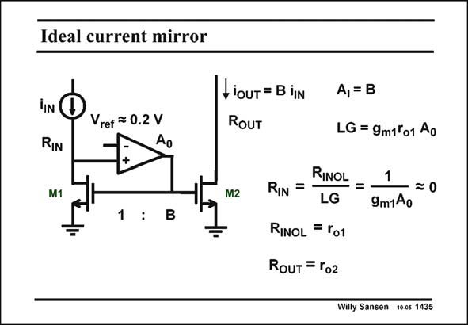

# SANSEN-1435 · Ideal current mirror

章节：14 反馈跨阻放大器与电流放大器  
PDF 页：398；书本页：406；幻灯片编号：1435  
状态：unreviewed



## 对应教材讲解

### PDF 398 · 书本 406

Such a current mirror is shown in this slide. Its current gain A is now B, which I is the ratio between W /L 2 2 and W /L . 1 1 The simplest current mirror has a short between the Drain and Gate of transistor M1. The specifications can be improved a lot by insertion of an opamp with high gain A . This circuit is 0 only one of the many possible configurations of current mirrors, as shown in Chapter 3. This one has the advantage that it can operate at low supply voltages. Indeed the Drain of transistor M1 is maintained at 0.2 V rather than at 0.9 V for a simple current mirror. The loop gain LG is very large. The input resistance is therefore very small. The output resistance, however, is not so large. It is merely the output resistance r of o2 transistor M2.

## 公式／性能结论候选摘录

以下为规则截取的原文，尚未逐项判读。

- PDF 398: Its current gain A is now B, which I is the ratio between W /L 2 2 and W /L . 1 1 The simplest current mirror has a short between the Drain and Gate of transistor M1.
- PDF 398: The specifications can be improved a lot by insertion of an opamp with high gain A .
- PDF 398: The loop gain LG is very large.
- PDF 398: The input resistance is therefore very small.

## 曲线结论候选摘录

以下为规则截取的原文，尚未逐项判读。

（未由规则找到；不代表原页没有此类内容。）

## 原文条件与近似候选摘录

以下为规则截取的原文，尚未逐项判读。

（未由规则找到；不代表原页没有此类内容。）

## 幻灯片 OCR（未校正）

```text
Ideal current mirror
Vref ~ 0.2 V
Ao
LioUT = B iN
RoUT
RIN
M1
M2
1 :
A, = B
LG = 9m1 o1 Ao
RIN =-
RINOL = -
1
- =0
9m1Ao
RINOL =r01
RouT = ro2
Willy Sansen 1005 1435
```

数学上下标、分数及正负号以原图为准。电路图已保留；未核对的连接不输出成可仿真 netlist。
