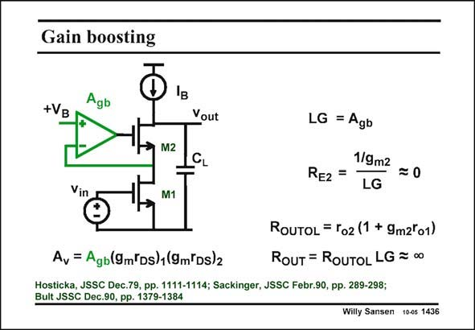

# SANSEN-1436 · Gain boosting

章节：14 反馈跨阻放大器与电流放大器  
PDF 页：398；书本页：406；幻灯片编号：1436  
状态：unreviewed



## 对应教材讲解

### PDF 398 · 书本 406

A beautiful example of shunt-series feedback is gain boosting. As explained already in Chapter 2, gain boosting or regulating the cascode means that feedback is applied around the cascode, as shown in this slide. The loop gain LG is the gain A because transistor gb M2 behaves as a Source follower for the feedback loop. As a result of the feedback loop, the output resistance R of the amplifier in- OUT creases by the gain A of the gain-boosting amplifier, and so does the gain A of the total gb v amplifier. The resistance R between both transistors, at the Source of M2, is then divided by the same E2 loop gain LG or A . gb

## 公式／性能结论候选摘录

以下为规则截取的原文，尚未逐项判读。

- PDF 398: A beautiful example of shunt-series feedback is gain boosting.
- PDF 398: As explained already in Chapter 2, gain boosting or regulating the cascode means that feedback is applied around the cascode, as shown in this slide.
- PDF 398: The loop gain LG is the gain A because transistor gb M2 behaves as a Source follower for the feedback loop.
- PDF 398: As a result of the feedback loop, the output resistance R of the amplifier in- OUT creases by the gain A of the gain-boosting amplifier, and so does the gain A of the total gb v amplifier.
- PDF 398: The resistance R between both transistors, at the Source of M2, is then divided by the same E2 loop gain LG or A . gb

## 曲线结论候选摘录

以下为规则截取的原文，尚未逐项判读。

（未由规则找到；不代表原页没有此类内容。）

## 原文条件与近似候选摘录

以下为规则截取的原文，尚未逐项判读。

（未由规则找到；不代表原页没有此类内容。）

## 幻灯片 OCR（未校正）

```text
Gain boosting
Agb
+VB
Vout
M2
CL
Vin
M1
LG = Agb
1/9m2
RE2 =
=0
LG
ROUTOL = Fo2 (1 + 9m2°o1)
Av = Agb(9mlDs)1(9m Ds)2
RoUT = RoUTOL LG = ∞0
Hosticka, JSSC Dec.79, pp. 1111-1114; Sackinger, JSSC Febr.90, pp. 289-298;
Bult JSSC Dec.90, pp. 1379-1384
Willy Sansen 10-05 1436
```

数学上下标、分数及正负号以原图为准。电路图已保留；未核对的连接不输出成可仿真 netlist。
