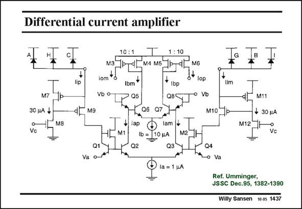

# SANSEN-1437 · Differential current amplifier

章节：14 反馈跨阻放大器与电流放大器  
PDF 页：399；书本页：407；幻灯片编号：1437  
状态：unreviewed



## 对应教材讲解

### PDF 399 · 书本 407

A more complicated current amplifier using mainly current mirrors is shown in this slide. The input currents are provided by photo-diodes. These currents are picked up by regulated cascodes M9 and M10 and are mirrored (and amplified) towards a translinear circuit consisting of transistors Q5–8. Their output currents are mirrored and amplified by a factor of 10. This is now a current amplifier without feedback.

## 公式／性能结论候选摘录

以下为规则截取的原文，尚未逐项判读。

（未由规则找到；不代表原页没有此类内容。）

## 曲线结论候选摘录

以下为规则截取的原文，尚未逐项判读。

（未由规则找到；不代表原页没有此类内容。）

## 原文条件与近似候选摘录

以下为规则截取的原文，尚未逐项判读。

- PDF 399: The input currents are provided by photo-diodes.

## 幻灯片 OCR（未校正）

```text
Differential current amplifier
M7
30 uA +
Vc
M8
lip
10 : 11
1 :10
M3
N.4 M5
Iom
Ibm
Ibp
Vb o
05
Q8
Q6
ap
lam
M1
Ib =
10 JA
M2
02
Va
la = 1 HA
M6
G
lop
Iim
Vb
M10
P-
Q4
• Va
B
M11
+ 30 uA
M12
Vcl
Ref. Umminger,
JSSC Dec.95, 1382-1390
Willy Sansen 10.05 1437
```

数学上下标、分数及正负号以原图为准。电路图已保留；未核对的连接不输出成可仿真 netlist。
