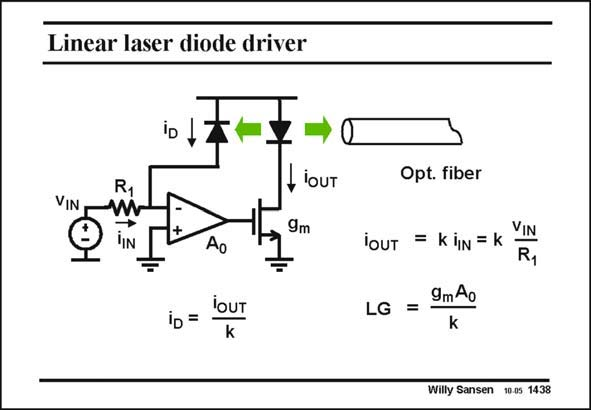

# SANSEN-1438 · Linear laser diode driver

章节：14 反馈跨阻放大器与电流放大器  
PDF 页：399；书本页：407；幻灯片编号：1438  
状态：unreviewed



## 对应教材讲解

### PDF 399 · 书本 407

As a final example of shuntseries feedback a linear LED driver is given. A LED (Light Emitting Diode) or laser diode gives light in a very non-linear way depending on the voltage applied. However, the light output is linear versus the current. Also, the MOST driver transistor is nonlinear. This can be solved by creating the shunt-series feedback loop shown in this slide. The light of the LED is sensed by a photodiode, which acts as a current source. It injects its current at the input of the opamp, where it is added to the current i from the input source v . At the input, we have the shunt feedback. IN IN The output is the current provided by the output transistor. This is the series feedback. We now have a current amplifier. It is very linear versus the input current, and for the input voltage v . IN

## 公式／性能结论候选摘录

以下为规则截取的原文，尚未逐项判读。

- PDF 399: A LED (Light Emitting Diode) or laser diode gives light in a very non-linear way depending on the voltage applied.

## 曲线结论候选摘录

以下为规则截取的原文，尚未逐项判读。

（未由规则找到；不代表原页没有此类内容。）

## 原文条件与近似候选摘录

以下为规则截取的原文，尚未逐项判读。

- PDF 399: IN IN The output is the current provided by the output transistor.

## 幻灯片 OCR（未校正）

```text
Linear laser diode driver
VIN
- loUT
9m
lOUT
iD =
Opt. fiber
VIN
iOUT = k iN = K
R1
LG =
9mAo
k
Willy Sansen 10.05 1438
```

数学上下标、分数及正负号以原图为准。电路图已保留；未核对的连接不输出成可仿真 netlist。
