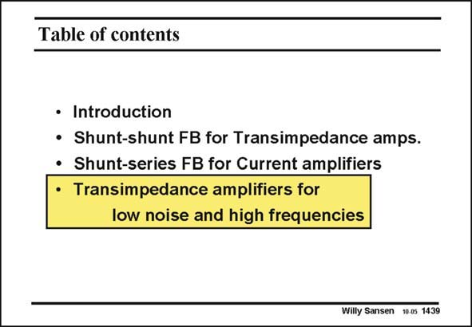

# SANSEN-1439 · Table of contents

章节：14 反馈跨阻放大器与电流放大器  
PDF 页：400；书本页：408；幻灯片编号：1439  
状态：unreviewed



## 对应教材讲解

### PDF 400 · 书本 408

We go back to transimpedance amplifiers. The reason is that they are of great importance of all photodiode receivers. Their most important specifications are low noise and high bandwidth. They are now discussed in more detail. First of all, we want to figure out whether to use a voltage amplifier at the input or a current amplifier.

## 公式／性能结论候选摘录

以下为规则截取的原文，尚未逐项判读。

- PDF 400: Their most important specifications are low noise and high bandwidth.

## 曲线结论候选摘录

以下为规则截取的原文，尚未逐项判读。

（未由规则找到；不代表原页没有此类内容。）

## 原文条件与近似候选摘录

以下为规则截取的原文，尚未逐项判读。

（未由规则找到；不代表原页没有此类内容。）

## 幻灯片 OCR（未校正）

```text
Table of contents
• Introduction
• Shunt-shunt FB for Transimpedance amps.
• Shunt-series FB for Current amplifiers
• Transimpedance amplifiers for
low noise and high frequencies
Willy Sansen 10-05 1439
```

数学上下标、分数及正负号以原图为准。电路图已保留；未核对的连接不输出成可仿真 netlist。
