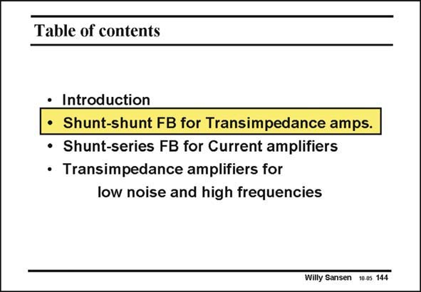

# SANSEN-144 · Table of contents

章节：14 反馈跨阻放大器与电流放大器  
PDF 页：382；书本页：390；幻灯片编号：144  
状态：unreviewed



## 对应教材讲解

### PDF 382 · 书本 390

Let us now discuss shuntshunt feedback in more detail. It is a kind of amplifier which provides an accurate current-to-voltage conversion, as in photodiode detectors or pixel detectors. They are called transimpedance amplifiers. First of all, we will assume a more general case, i.e. the input impedance is not infinite but has a limited value. Also, the output resistance is not zero. We want to calculate again the loop gain, the closed and open-loop gains, and finally the input and output resistances.

## 公式／性能结论候选摘录

以下为规则截取的原文，尚未逐项判读。

- PDF 382: First of all, we will assume a more general case, i.e. the input impedance is not infinite but has a limited value.
- PDF 382: We want to calculate again the loop gain, the closed and open-loop gains, and finally the input and output resistances.

## 曲线结论候选摘录

以下为规则截取的原文，尚未逐项判读。

（未由规则找到；不代表原页没有此类内容。）

## 原文条件与近似候选摘录

以下为规则截取的原文，尚未逐项判读。

- PDF 382: First of all, we will assume a more general case, i.e. the input impedance is not infinite but has a limited value.

## 幻灯片 OCR（未校正）

```text
Table of contents
• Introduction
• Shunt-shunt FB for Transimpedance amps.
• Shunt-series FB for Current amplifiers
• Transimpedance amplifiers for
low noise and high frequencies
Willy Sansen 10-05 144
```

数学上下标、分数及正负号以原图为准。电路图已保留；未核对的连接不输出成可仿真 netlist。
