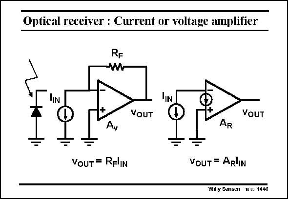

# SANSEN-1440 · Optical receiver : Current or voltage amplifier

章节：14 反馈跨阻放大器与电流放大器  
PDF 页：400；书本页：408；幻灯片编号：1440  
状态：unreviewed



## 对应教材讲解

### PDF 400 · 书本 408

The photodiode can be modeled by a current source I . IN It can applied to a transimpedance amplifier, i.e. a voltage amplifier with a feedback resistor R or to F an amplifier without feedback but with a current input which has a transimpedance A . If R equals A , R F R then both have the same gain. Which one would have the higher bandwidth BW? A Figure-of-merit could be the product A BW, usually expressed in THzV. Which one would have the higher A BW R R product?

## 公式／性能结论候选摘录

以下为规则截取的原文，尚未逐项判读。

- PDF 400: If R equals A , R F R then both have the same gain.
- PDF 400: Which one would have the higher bandwidth BW?

## 曲线结论候选摘录

以下为规则截取的原文，尚未逐项判读。

（未由规则找到；不代表原页没有此类内容。）

## 原文条件与近似候选摘录

以下为规则截取的原文，尚未逐项判读。

（未由规则找到；不代表原页没有此类内容。）

## 幻灯片 OCR（未校正）

```text
Optical receiver : Current or voltage amplifier
IN
VOUT
VOUT
Ay
AR
VOUT = RFlIN
VOUT = AR'IN
Willy Sansen 10.0s 1440
```

数学上下标、分数及正负号以原图为准。电路图已保留；未核对的连接不输出成可仿真 netlist。
