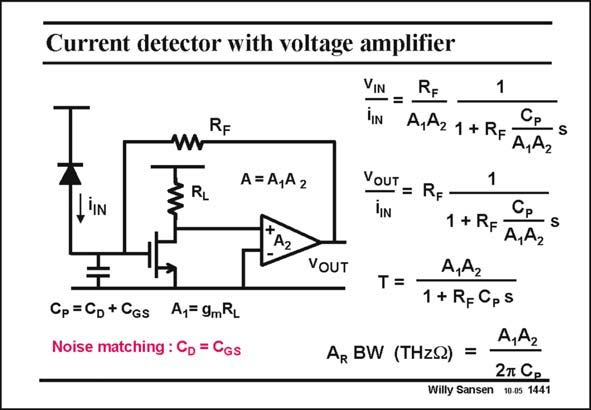

# SANSEN-1441 · Current detector with voltage amplifier

章节：14 反馈跨阻放大器与电流放大器  
PDF 页：401；书本页：409；幻灯片编号：1441  
状态：unreviewed



## 对应教材讲解

### PDF 401 · 书本 409

In order to find the bandwidth, we have to find the node with the largest time constant. This is most likely the input node. Indeed the capacitance C at the input P is the sum of the diode capacitance C and the D input capacitance C of the GS input transistor. Since they are about the same, because of noise matching (see Chapter 4), we can as well take 2C for C . D P This time constant is then R C /A A . It is smaller, or F P 1 2 the BW is larger for smaller R and larger gains A and A . F 1 2 The A BW product however only depends on the diode capacitance C and the two gains A R D 1 and A . 2 In order to increase the gain A we have to increase load resistor R . The capacitance at that 1 L Drain will cause a second pole however, as shown next.

## 公式／性能结论候选摘录

以下为规则截取的原文，尚未逐项判读。

- PDF 401: In order to find the bandwidth, we have to find the node with the largest time constant.
- PDF 401: F 1 2 The A BW product however only depends on the diode capacitance C and the two gains A R D 1 and A . 2 In order to increase the gain A we have to increase load resistor R .

## 曲线结论候选摘录

以下为规则截取的原文，尚未逐项判读。

（未由规则找到；不代表原页没有此类内容。）

## 原文条件与近似候选摘录

以下为规则截取的原文，尚未逐项判读。

（未由规则找到；不代表原页没有此类内容。）

## 幻灯片 OCR（未校正）

```text
Current detector with voltage amplifier
VIN
TIN
RF
ZRL
A= A,A2
A2
Cp =Cp + CGs
A,= 9mRL
Noise matching : Cp = Cgs
1
A,A2 1 + RF
Cр
S
A,A2
VOUT
=
TIn
1
Ср
1 + RF
S
A,A2
VOUT
A,A2
T=
1 + R=CpS
A,A2
AR BW (THzS) =
27 C.
Willy Sansen 10.05 1441
```

数学上下标、分数及正负号以原图为准。电路图已保留；未核对的连接不输出成可仿真 netlist。
