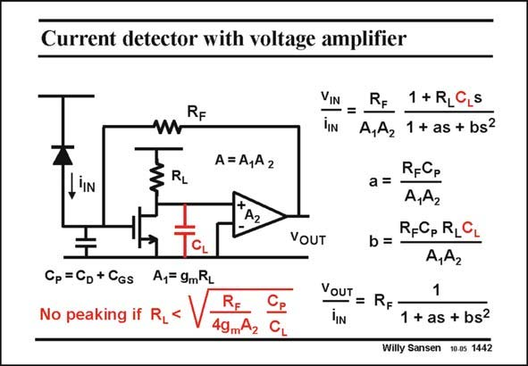

# SANSEN-1442 · Current detector with voltage amplifier

章节：14 反馈跨阻放大器与电流放大器  
PDF 页：401；书本页：409；幻灯片编号：1442  
状态：unreviewed



## 对应教材讲解

### PDF 401 · 书本 409

When we take into account the capacitance C at the L Drain of the input transistor, we then obtain a second-order expression for the transimpedance. To avoid peaking, we must have two real poles. This condition imposes an upper limit on the value of load resistor R . Increasing the L gain A too much, would 2 only decrease the R and L hence gain A . 1

## 公式／性能结论候选摘录

以下为规则截取的原文，尚未逐项判读。

- PDF 401: This condition imposes an upper limit on the value of load resistor R .
- PDF 401: Increasing the L gain A too much, would 2 only decrease the R and L hence gain A . 1

## 曲线结论候选摘录

以下为规则截取的原文，尚未逐项判读。

- PDF 401: To avoid peaking, we must have two real poles.

## 原文条件与近似候选摘录

以下为规则截取的原文，尚未逐项判读。

（未由规则找到；不代表原页没有此类内容。）

## 幻灯片 OCR（未校正）

```text
Current detector with voltage amplifier
RF
W
RL
A= A,A2
A2
VOUT
Cp =Cp + Cgs
CL
A,= 9mRL
No peaking if R,<
RE
Ce
49mA2 CL
VIN
1 + RLC
LS
=
lIN
A,A2 1 + as + bsz
R-Cp
a =
A,A2
b= RFCp RLG
A,A2
VOUT
1
= RF
IIN
1 + as + bs?
Willy Sansen 10.05 1442
```

数学上下标、分数及正负号以原图为准。电路图已保留；未核对的连接不输出成可仿真 netlist。
