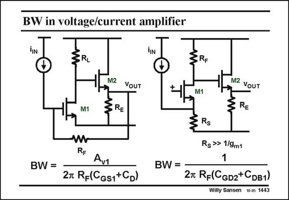

# SANSEN-1443 · BW in voltage/current amplifier

章节：14 反馈跨阻放大器与电流放大器  
PDF 页：402；书本页：410；幻灯片编号：1443  
状态：unreviewed



## 对应教材讲解

### PDF 402 · 书本 410

For sake of comparison let us optimize both the transimpedance amplifier with voltage input (on the left) and the one with current input (on the left). The latter one usually has a cascode at the input or a regulated cascode (see later). Both amplifiers have the same transresistance R . F Both amplifiers are designed for high frequencies. They are simple and carry fairly large currents! Which one has the larger BW? The dominant pole in the first amplifier is clearly at the input. The capacitance at the input node is again C +C or about 2C . Load resistor R is sufficiently small such that the second D GS D L pole does not play. The dominant pole in the cascode amplifier is not at the input. The input capacitance is the same but the input resistance is only 1/g . This pole is now at about f /2 of the input transistor. m T The dominant pole is this time at the Drain. It is clear, that for about equal input transistors, the BW of the first transistor is higher. The capacitances all have similar values. The gain factor A in the first amplifier, or the feedback in v1 the first amplifier, makes the difference! The main advantage of the second amplifier is that its input impedance is constant (and equal to 1/g ) up to high frequencies. m

## 公式／性能结论候选摘录

以下为规则截取的原文，尚未逐项判读。

- PDF 402: It is clear, that for about equal input transistors, the BW of the first transistor is higher.
- PDF 402: The gain factor A in the first amplifier, or the feedback in v1 the first amplifier, makes the difference!
- PDF 402: The main advantage of the second amplifier is that its input impedance is constant (and equal to 1/g ) up to high frequencies. m

## 曲线结论候选摘录

以下为规则截取的原文，尚未逐项判读。

（未由规则找到；不代表原页没有此类内容。）

## 原文条件与近似候选摘录

以下为规则截取的原文，尚未逐项判读。

（未由规则找到；不代表原页没有此类内容。）

## 幻灯片 OCR（未校正）

```text
BW in voltage/current amplifier
SRI
SRF
M1
M2
SRE
YoUT
+1
M1
M2 VOUT
ZRE
BW=
RF
Av1
27 RF(CGs1+CD)
BW =
Rs
Rg» 1/9m1
1
27 R-(CgD2+CDB1)
Willy Sansen 10 os 1443
```

数学上下标、分数及正负号以原图为准。电路图已保留；未核对的连接不输出成可仿真 netlist。
