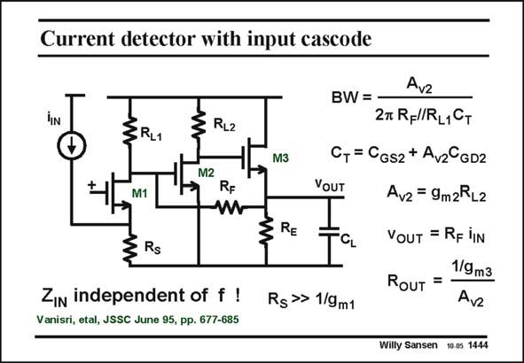

# SANSEN-1444 · Current detector with input cascode

章节：14 反馈跨阻放大器与电流放大器  
PDF 页：402；书本页：410；幻灯片编号：1444  
状态：unreviewed



## 对应教材讲解

### PDF 402 · 书本 410

This photo current detector is a shunt-shunt feedback pair, preceded by a cascode again. The main reason is to have an input impedance which is independent of frequency, not to interact with the current source. A cascode has an input resistance of 1/g , which goes up to m1 very high frequencies. The transresistance is simply R , as the input cur- F rent flows through the cascode into resistor R . The F Gate of transistor M2 is at a low resistance because of the feedback.

### PDF 403 · 书本 411

The loop gain is A . The bandwidth is increased by this loop gain. Also, the output resistance v2 R is decreased by that same loop gain. OUT The dominant time constant is at the Drain of transistor M1. It has a fairly large capacitance because of the Miller effect across transistor M2. Moreover, resistor R is fairly high to have L1 high gain. The time constants at the nodes are smaller. For example, at the input node, the time constant is g /C , which is the f of the transistor M1. The time constant at the Drain of m1 GS1 T transistor M2 is too small since the capacitance at this node contains mainly the output capacitance of transistor M2. The input capacitance of transistor M3 is bootstrapped as transistor M3 is a Source follower.

## 公式／性能结论候选摘录

以下为规则截取的原文，尚未逐项判读。

- PDF 402: The main reason is to have an input impedance which is independent of frequency, not to interact with the current source.
- PDF 403: The loop gain is A .
- PDF 403: The bandwidth is increased by this loop gain.
- PDF 403: Also, the output resistance v2 R is decreased by that same loop gain.
- PDF 403: Moreover, resistor R is fairly high to have L1 high gain.

## 曲线结论候选摘录

以下为规则截取的原文，尚未逐项判读。

（未由规则找到；不代表原页没有此类内容。）

## 原文条件与近似候选摘录

以下为规则截取的原文，尚未逐项判读。

（未由规则找到；不代表原页没有此类内容。）

## 幻灯片 OCR（未校正）

```text
Current detector with input cascode
+
ZRL1
M1
Rs
RL2
M2
RF
W
Zin independent of f !
Vanisri, etal, JSSC June 95, pp. 677-685
M3
RE
Avz
BW = -
27 RFl/RL1Cт
C, = CGs2 + Avz°GD2
VOUT
Av2 = 9m2RL2
CL
Rg» 1/9m1
VOUT = RF lIN
1/9 m3
RoUT =
Avz
Willy Sansen 10.0s 1444
```

数学上下标、分数及正负号以原图为准。电路图已保留；未核对的连接不输出成可仿真 netlist。
