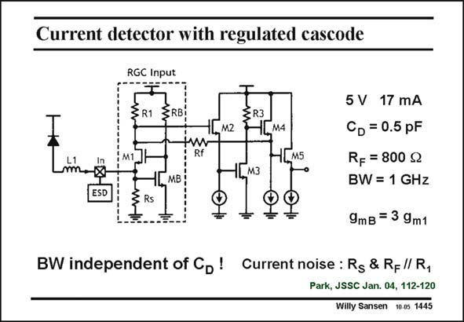

# SANSEN-1445 · Current detector with regulated cascode

章节：14 反馈跨阻放大器与电流放大器  
PDF 页：403；书本页：411；幻灯片编号：1445  
状态：unreviewed



## 对应教材讲解

### PDF 403 · 书本 411

A similar current input is realized here by means of a regulated cascode. Gain boosting is introduced by means of transistor MB. As a consequence, the input resistance will be smaller at low frequencies. At higher frequencies however, the local feedback gain rolls off. Moreover, it can form complex poles at intermediate frequencies. For very high frequencies, it is better to use single-transistor cascodes. For intermediate or low frequencies a regulated cascode can be advantageous. Moreover, the more transistors are used, the larger number of noise sources can play a role. Does the current-input amplifier perform as well as the voltage-input amplifier?

## 公式／性能结论候选摘录

以下为规则截取的原文，尚未逐项判读。

- PDF 403: Gain boosting is introduced by means of transistor MB.
- PDF 403: At higher frequencies however, the local feedback gain rolls off.

## 曲线结论候选摘录

以下为规则截取的原文，尚未逐项判读。

（未由规则找到；不代表原页没有此类内容。）

## 原文条件与近似候选摘录

以下为规则截取的原文，尚未逐项判读。

（未由规则找到；不代表原页没有此类内容。）

## 幻灯片 OCR（未校正）

```text
Current detector with regulated cascode
RGC Input
ZRI SRB
M1]
SR3
1L. M2
tw
1Дм4
Rf
1EM5
LM3
ESD
LMB
-m
=
5 V 17 mA
CD = 0.5 pF
RF = 800 g
BW = 1 GHz
9mB = 3 9m1
BW independent of Cb! Current noise : Rs & Rf // R,
Park, JSSC Jan. 04, 112-120
Willy Sansen 10.05 1445
```

数学上下标、分数及正负号以原图为准。电路图已保留；未核对的连接不输出成可仿真 netlist。
