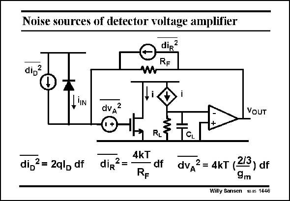

# SANSEN-1446 · Noise sources of detector voltage amplifier

章节：14 反馈跨阻放大器与电流放大器  
PDF 页：403；书本页：411；幻灯片编号：1446  
状态：unreviewed



## 对应教材讲解

### PDF 403 · 书本 411

The noise performance is now compared of both types of transimpedance amplifiers. The one with a voltage input comes first. All the relevant noise sources are shown. The first one is the diode current shot noise, which is in parallel with the photo diode. The second one is the noise generated by the feedback resistor R . It is taken F as a current as we have a current input! The third one is the equiv-

### PDF 404 · 书本 412

alent input noise voltage of the amplifier. We assume that it is mainly the input transistor which is responsible for the amplifier noise. Only thermal noise is taken into account.

## 公式／性能结论候选摘录

以下为规则截取的原文，尚未逐项判读。

（未由规则找到；不代表原页没有此类内容。）

## 曲线结论候选摘录

以下为规则截取的原文，尚未逐项判读。

（未由规则找到；不代表原页没有此类内容。）

## 原文条件与近似候选摘录

以下为规则截取的原文，尚未逐项判读。

- PDF 404: We assume that it is mainly the input transistor which is responsible for the amplifier noise.

## 幻灯片 OCR（未校正）

```text
Noise sources of detector voltage amplifier
dir
RF
dip2
,IN
dvд2
VOUT
di,?= 2ql, df
dir
2=
4kT
RF
RL
df
dvA2 = 4kT (2/3) df
9m
Willy Sansen 10-05 1446
```

数学上下标、分数及正负号以原图为准。电路图已保留；未核对的连接不输出成可仿真 netlist。
