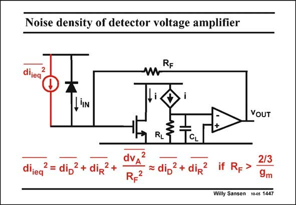

# SANSEN-1447 · Noise density of detector voltage amplifier

章节：14 反馈跨阻放大器与电流放大器  
PDF 页：404；书本页：412；幻灯片编号：1447  
状态：unreviewed



## 对应教材讲解

### PDF 404 · 书本 412

The total equivalent input noise current is now calculated. For this purpose, the gain from each noise source to the output is calculated, added in power, and then divided by the total transconductance, which is R . F The expression shows that the noise of the input transistor is actually divided by R squared towards the F input. Making R larger will F make the noise of the input transistor negligible. A fairly small value of R is already F sufficient! The noise of the feedback resistor R is now the dominant noise source, obviously, in addition F to the noise of the diode itself. Since the resistor noise is a current, the larger the resistor, the lower its noise!

## 公式／性能结论候选摘录

以下为规则截取的原文，尚未逐项判读。

- PDF 404: For this purpose, the gain from each noise source to the output is calculated, added in power, and then divided by the total transconductance, which is R .

## 曲线结论候选摘录

以下为规则截取的原文，尚未逐项判读。

（未由规则找到；不代表原页没有此类内容。）

## 原文条件与近似候选摘录

以下为规则截取的原文，尚未逐项判读。

（未由规则找到；不代表原页没有此类内容。）

## 幻灯片 OCR（未校正）

```text
Noise density of detector voltage amplifier
RF
dijeq
2
,IN
VOUT
dijeq
•= diD
+
diR
dVA
RF
2
diD
+ diR
if
RF
2/3
9m
Willy Sansen 10-05 1447
```

数学上下标、分数及正负号以原图为准。电路图已保留；未核对的连接不输出成可仿真 netlist。
