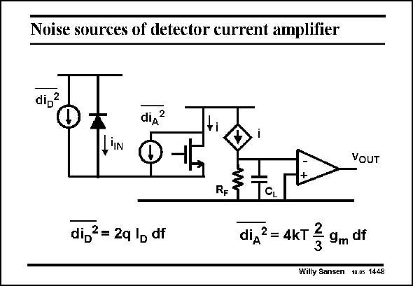

# SANSEN-1448 · Noise sources of detector current amplifier

章节：14 反馈跨阻放大器与电流放大器  
PDF 页：404；书本页：412；幻灯片编号：1448  
状态：unreviewed



## 对应教材讲解

### PDF 404 · 书本 412

If a cascode is used at the input then the noise current of that cascode transistor comes in. It is the only noise source around, in addition to the noise of the diode itself. Note that the load resistor R is the same as R for L F the voltage-input amplifier so that the transimpedances are the same.

## 公式／性能结论候选摘录

以下为规则截取的原文，尚未逐项判读。

（未由规则找到；不代表原页没有此类内容。）

## 曲线结论候选摘录

以下为规则截取的原文，尚未逐项判读。

（未由规则找到；不代表原页没有此类内容。）

## 原文条件与近似候选摘录

以下为规则截取的原文，尚未逐项判读。

（未由规则找到；不代表原页没有此类内容。）

## 幻灯片 OCR（未校正）

```text
Noise sources of detector current amplifier
di,2
diд?
VOUT
di,ª= 2q lp df
CL
diдZ = 4KT Z 9m df
Willy Sansen 10.05 1448
```

数学上下标、分数及正负号以原图为准。电路图已保留；未核对的连接不输出成可仿真 netlist。
