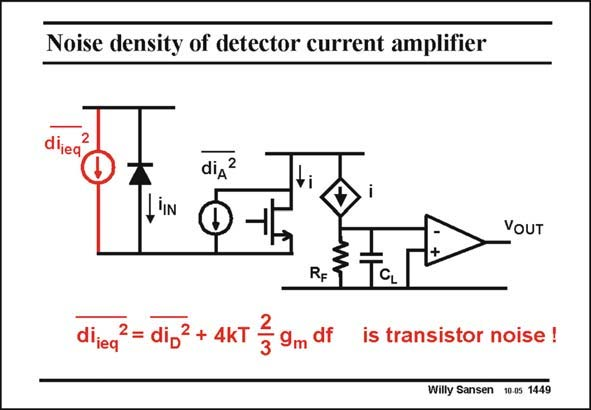

# SANSEN-1449 · Noise density of detector current amplifier

章节：14 反馈跨阻放大器与电流放大器  
PDF 页：405；书本页：413；幻灯片编号：1449  
状态：unreviewed



## 对应教材讲解

### PDF 405 · 书本 413

Whether the noise of the cascode plays a role really depends on the load seen by that cascode. In this example the cascode sees the input of a current mirror, which is a low resistor (usually 1/g ). In this case, the m current noise of the cascode can flow from the supply through the diode to ground. It is now added to the output current and to the noise current of the diode. If the cascode were loaded with a very high impedance, in order to create a lot of gain, as is common in opamps, then the noise current of the cascode would be negligible. It is difficult to create a high impedance at the output of the cascode however in this kind of circuit, as it is to work at real high frequencies. The noise current of the cascode will usually be the dominant noise source!

## 公式／性能结论候选摘录

以下为规则截取的原文，尚未逐项判读。

- PDF 405: Whether the noise of the cascode plays a role really depends on the load seen by that cascode.
- PDF 405: If the cascode were loaded with a very high impedance, in order to create a lot of gain, as is common in opamps, then the noise current of the cascode would be negligible.

## 曲线结论候选摘录

以下为规则截取的原文，尚未逐项判读。

（未由规则找到；不代表原页没有此类内容。）

## 原文条件与近似候选摘录

以下为规则截取的原文，尚未逐项判读。

（未由规则找到；不代表原页没有此类内容。）

## 幻灯片 OCR（未校正）

```text
Noise density of detector current amplifier
diieq
2
diд?
,IN
VOUT
dlieq
2= di,2 + 4kT
2
9m df
is transistor noise !
Willy Sansen 1005 1449
```

数学上下标、分数及正负号以原图为准。电路图已保留；未核对的连接不输出成可仿真 netlist。
