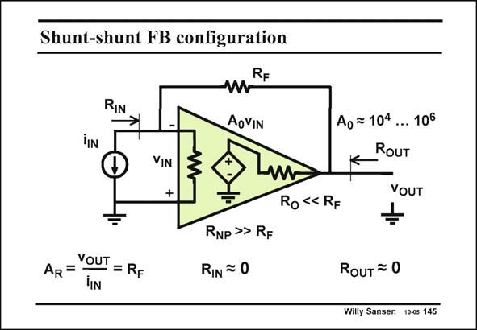

# SANSEN-145 · Shunt-shunt FB configuration

章节：14 反馈跨阻放大器与电流放大器  
PDF 页：383；书本页：391；幻灯片编号：145  
状态：unreviewed



## 对应教材讲解

### PDF 383 · 书本 391

This feedback arrangement is very simple indeed. The input signal current i will IN flow through the feedback resistor R to create an F output voltage i R . The IN F transresistance is simply R F itself. This amplifier has a lot of gain (A is between 104 and 0 106). As a result, whatever the output voltage is, the differential input voltage v IN will be quite small, comparable to noise. The minus terminal of the amplifier is now at about zero Volt. The current through input resistance R is also about zero. This is certainly NP the case for a MOST for which resistor R is infinity. This is also true however, for a bipolar NP transistor which has a finite input resistance R . NP All the input current flows through the feedback resistor R . This is why the output voltage F is quite accurately equal to i R . IN F The feedback resistor R is usually much larger than the output resistance R . Later on we F O will find out what to do if this is not the case. We will call it output loading then. We want to learn about the loop gain first.

## 公式／性能结论候选摘录

以下为规则截取的原文，尚未逐项判读。

- PDF 383: This amplifier has a lot of gain (A is between 104 and 0 106).
- PDF 383: As a result, whatever the output voltage is, the differential input voltage v IN will be quite small, comparable to noise.
- PDF 383: This is why the output voltage F is quite accurately equal to i R .
- PDF 383: We want to learn about the loop gain first.

## 曲线结论候选摘录

以下为规则截取的原文，尚未逐项判读。

（未由规则找到；不代表原页没有此类内容。）

## 原文条件与近似候选摘录

以下为规则截取的原文，尚未逐项判读。

- PDF 383: IN F The feedback resistor R is usually much larger than the output resistance R .

## 幻灯片 OCR（未校正）

```text
Shunt-shunt FB configuration
RIN
RF
AoVIN
VIN
+
Ao = 104
... 106
RoUT
VOUT
Ro «< RF
AR=YOUT = RF
RNP >> RF
RIN = 0
RouT = 0
Willy Sansen 10-05 145
```

数学上下标、分数及正负号以原图为准。电路图已保留；未核对的连接不输出成可仿真 netlist。
