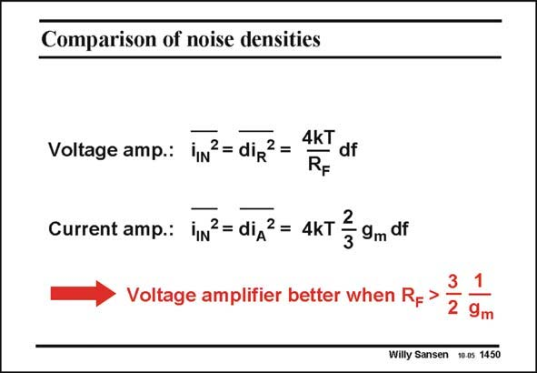

# SANSEN-1450 · Comparison of noise densities

章节：14 反馈跨阻放大器与电流放大器  
PDF 页：405；书本页：413；幻灯片编号：1450  
状态：unreviewed



## 对应教材讲解

### PDF 405 · 书本 413

A comparison between a voltage-input transimpedance amplifier and a current-input one is now easily made. The expressions of the equivalent input noise current densities are repeated in this slide. It is clear that the voltageinput amplifier is better, provided its R is suffi- F ciently large, i.e. larger than 1.5/g . m This is normally the case!

## 公式／性能结论候选摘录

以下为规则截取的原文，尚未逐项判读。

（未由规则找到；不代表原页没有此类内容。）

## 曲线结论候选摘录

以下为规则截取的原文，尚未逐项判读。

（未由规则找到；不代表原页没有此类内容。）

## 原文条件与近似候选摘录

以下为规则截取的原文，尚未逐项判读。

- PDF 405: It is clear that the voltageinput amplifier is better, provided its R is suffi- F ciently large, i.e. larger than 1.5/g . m This is normally the case!

## 幻灯片 OCR（未校正）

```text
Comparison of noise densities
4kT
Voltage amp.: iN?= dip2 =
—df
RF
Current amp.: iN?= diд2= 4kT
-
3
- 9m df
Voltage amplifier better when R->
2
1
9m
Willy Sansen 10.05 1450
```

数学上下标、分数及正负号以原图为准。电路图已保留；未核对的连接不输出成可仿真 netlist。
