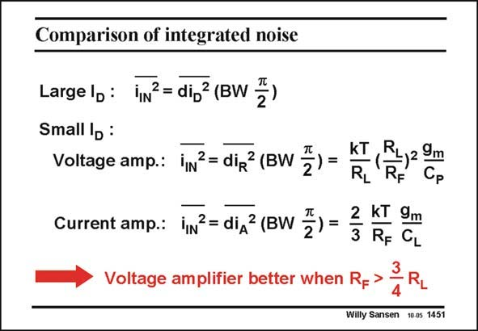

# SANSEN-1451 · Comparison of integrated noise

章节：14 反馈跨阻放大器与电流放大器  
PDF 页：406；书本页：414；幻灯片编号：1451  
状态：unreviewed



## 对应教材讲解

### PDF 406 · 书本 414

A similar comparison can be carried out for the total integrated noise. For this purpose, the noise densities have to be multiplied with the noise bandwidths or the bandwidths themselves, multiplied by p/2 (see Chapter 4). For the voltage-input amplifier, the BW is determined at the input node of the input transistor. The total input capacitance C is P again about twice the diode capacitance. Remember that resistor R is the load resistor of the input transistor. L For the current-input amplifier the bandwidth is at the output node of the input transistor. The capacitance at this node is C . In the simple example of slide 41, this capacitance is the L output capacitance C of the input transistor. It has about the same size as its C capacitance. DB GS This load capacitance C is about half of C . L P The comparison shows that the voltage-input amplifier is better if feedback capacitor R is F larger than the load capacitor R . This is usually the case. L Moreover, care has to be taken to make the resistor R form the cascode Source to ground S (see slide 41) sufficiently large to avoid its current noise.

## 公式／性能结论候选摘录

以下为规则截取的原文，尚未逐项判读。

- PDF 406: L For the current-input amplifier the bandwidth is at the output node of the input transistor.

## 曲线结论候选摘录

以下为规则截取的原文，尚未逐项判读。

（未由规则找到；不代表原页没有此类内容。）

## 原文条件与近似候选摘录

以下为规则截取的原文，尚未逐项判读。

（未由规则找到；不代表原页没有此类内容。）

## 幻灯片 OCR（未校正）

```text
Comparison of integrated noise
LargelD:
SmalllD:
Voltage amp.:
= di, (BW =)
lN? = diR?(BW =
RL
Cp
Current amp.:
N? = diд7(BW =
2
3
KT 9m
RF GL
Voltage amplifier better when R= >
R,
Willy Sansen 10.05 1451
```

数学上下标、分数及正负号以原图为准。电路图已保留；未核对的连接不输出成可仿真 netlist。
