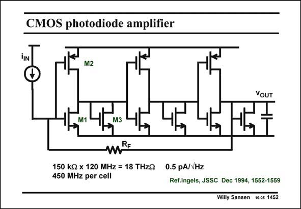

# SANSEN-1452 · CMOS photodiode amplifier

章节：14 反馈跨阻放大器与电流放大器  
PDF 页：406；书本页：414；幻灯片编号：1452  
状态：unreviewed



## 对应教材讲解

### PDF 406 · 书本 414

A good example of a CMOS voltage-input transimpedance amplifier is shown in this slide. It consists of three wide-band CMOS amplifiers with R as a feedback F resistor. The bandwidth of 120 MHz may not be all that high but the transimpedance of 150 kV is fairly high such that the BW.R F product is quite high, i.e. 18 THzV. The equivalent input noise current is mainly the current noise of feedback resistor R . F Each amplifier consists of a CMOS inverter amplifier loaded by the 1/g of a diode connected m nMOST. Input and output have the same DC voltage such that they are easily cascaded.

### PDF 407 · 书本 415

Moreover, all nodes are at low impedance (1/g level) such that the bandwidth can be fairly m high, depending on the DC biasing currents flowing. Such an amplifier is easily optimized as shown next.

## 公式／性能结论候选摘录

以下为规则截取的原文，尚未逐项判读。

- PDF 406: The bandwidth of 120 MHz may not be all that high but the transimpedance of 150 kV is fairly high such that the BW.R F product is quite high, i.e. 18 THzV.
- PDF 407: Moreover, all nodes are at low impedance (1/g level) such that the bandwidth can be fairly m high, depending on the DC biasing currents flowing.

## 曲线结论候选摘录

以下为规则截取的原文，尚未逐项判读。

（未由规则找到；不代表原页没有此类内容。）

## 原文条件与近似候选摘录

以下为规则截取的原文，尚未逐项判读。

（未由规则找到；不代表原页没有此类内容。）

## 幻灯片 OCR（未校正）

```text
CMOS photodiode amplifier
M2
Đ
VOUT
M1
МЗ
mRE
150 kg x 120 MHz = 18 THzQ
0.5 pA/VHz
450 MHz per cell
Ref.Ingels, JSSC Dec 1994, 1552-1559
Willy Sansen 10-05 1452
```

数学上下标、分数及正负号以原图为准。电路图已保留；未核对的连接不输出成可仿真 netlist。
