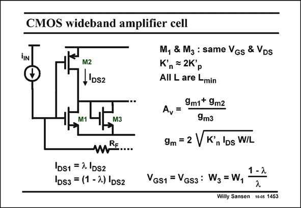

# SANSEN-1453 · CMOS wideband amplifier cell

章节：14 反馈跨阻放大器与电流放大器  
PDF 页：407；书本页：415；幻灯片编号：1453  
状态：unreviewed



## 对应教材讲解

### PDF 407 · 书本 415

One of the three cells of the previous amplifier is shown in this slide. The voltage gain A only v depends on the transconductances. Depending on the DC biasing currents and the widths, a small gain of 5–8 is easily achieved. The total gain for three similar stages is therefore, easily over 100. For the calculation of this gain, the current I DS2 through transistor M2 is assumed to be constant. It is divided over the transistors M1 and M2 by factor l. Since all lengths are taken the same, this factor l also determines the ratio of the widths W to W . 3 1 The gain A is now readily calculated. It is shown next. v

## 公式／性能结论候选摘录

以下为规则截取的原文，尚未逐项判读。

- PDF 407: The voltage gain A only v depends on the transconductances.
- PDF 407: Depending on the DC biasing currents and the widths, a small gain of 5–8 is easily achieved.
- PDF 407: The total gain for three similar stages is therefore, easily over 100.
- PDF 407: For the calculation of this gain, the current I DS2 through transistor M2 is assumed to be constant.
- PDF 407: Since all lengths are taken the same, this factor l also determines the ratio of the widths W to W . 3 1 The gain A is now readily calculated.

## 曲线结论候选摘录

以下为规则截取的原文，尚未逐项判读。

（未由规则找到；不代表原页没有此类内容。）

## 原文条件与近似候选摘录

以下为规则截取的原文，尚未逐项判读。

- PDF 407: For the calculation of this gain, the current I DS2 through transistor M2 is assumed to be constant.

## 幻灯片 OCR（未校正）

```text
CMOS wideband amplifier cell
M2
,'Ds2
M1
M3
mPE....
DS1 = 2 |DS2
1Ds3 = (1 - 2) |Ds2
M, & Mg : same VGs & VDs
K', = 2K'p
All L are Lmin
9m1+ 9mz
A,=
9m3
9m = 2 VK°, Ds W/L
VGS1 = VGs3: W3 = W,
1-2
2
Willy Sansen 1005 1453
```

数学上下标、分数及正负号以原图为准。电路图已保留；未核对的连接不输出成可仿真 netlist。
