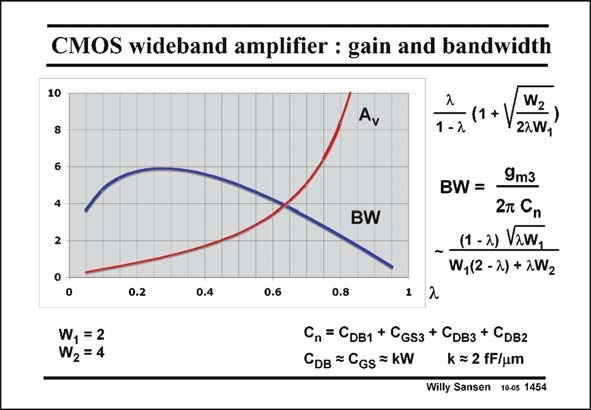

# SANSEN-1454 · CMOS wideband amplifier : gain and bandwidth

章节：14 反馈跨阻放大器与电流放大器  
PDF 页：407；书本页：415；幻灯片编号：1454  
状态：unreviewed



## 对应教材讲解

### PDF 407 · 书本 415

The gain A is calculated for v W =2 and W =4. These 1 2 are arbitrary units, for example micrometers or ratio’s to the channel length. The expression of the gain A is given in this slide. v It increases if the current through M3 is smaller. In this case the output resistance increases and so does the gain. A gain of 5 is reached for a l of about 0.7. In this case W is about 0.86. 3 The bandwidth BW is limited by the capacitance at the output node C , which is given in this slide. It is also easily calculated, noting that the BW n is also proportional to the square root of the total current I and some technological parameters. DS2 It reaches a maximum at a low value of the gain however, at about l=0.3. A compromise needs to be taken. For example for l=0.7, the BW is only about half of this maximum.

## 公式／性能结论候选摘录

以下为规则截取的原文，尚未逐项判读。

- PDF 407: The gain A is calculated for v W =2 and W =4.
- PDF 407: The expression of the gain A is given in this slide. v It increases if the current through M3 is smaller.
- PDF 407: In this case the output resistance increases and so does the gain.
- PDF 407: A gain of 5 is reached for a l of about 0.7.
- PDF 407: In this case W is about 0.86. 3 The bandwidth BW is limited by the capacitance at the output node C , which is given in this slide.
- PDF 407: It is also easily calculated, noting that the BW n is also proportional to the square root of the total current I and some technological parameters.
- PDF 407: DS2 It reaches a maximum at a low value of the gain however, at about l=0.3.

## 曲线结论候选摘录

以下为规则截取的原文，尚未逐项判读。

（未由规则找到；不代表原页没有此类内容。）

## 原文条件与近似候选摘录

以下为规则截取的原文，尚未逐项判读。

（未由规则找到；不代表原页没有此类内容。）

## 幻灯片 OCR（未校正）

```text
CMOS wideband amplifier : gain and bandwidth
10
8
Ay
4
BW
(1+
1 -2
W2
22W4
9m3
BW=
2T Cn
- (1 -2) Vaw,
W,(2 -2) + 2W2
0.2
0.4
0.6
W, =2
W2=4
0.8
1 2
Cn= CDB1 + CGs3 + Cрвз + CDB2
CDв = CGs = kW
k = 2 fF/um
Willy Sansen 10-05 1454
```

数学上下标、分数及正负号以原图为准。电路图已保留；未核对的连接不输出成可仿真 netlist。
