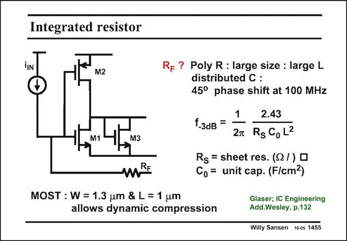

# SANSEN-1455 · Integrated resistor

章节：14 反馈跨阻放大器与电流放大器  
PDF 页：408；书本页：416；幻灯片编号：1455  
状态：unreviewed



## 对应教材讲解

### PDF 408 · 书本 416

One of the biggest problems with high-speed transimpedance amplifiers is the feedback resistor R . High F values are difficult to obtain at high frequencies. A conventional polysilicon resistor with length L for example (the length is the distance between the two contacts), has a certain sheet resistance R but also S a parallel distributed capacitance C to ground. It thus 0 acts as a kind of transmission line. Its −3 dB frequency heavily depends on the resistor length L. It is easy to calculate that poly resistors are difficult to make beyond about 100 MHz. A much better solution is to use a MOST in the linear region. Their areas W×L are quite small and so are their parallel capacitances. Their −3 dB frequency can therefore be much higher. In this example a nMOST is taken of merely 1.3×1 mm. This is the Gate voltage used which corresponds to about 150 kV. Indeed a MOST resistor can be made larger or smaller depending on the Gate voltage This allows dynamic compression, as shown next.

## 公式／性能结论候选摘录

以下为规则截取的原文，尚未逐项判读。

- PDF 408: It thus 0 acts as a kind of transmission line.
- PDF 408: Its −3 dB frequency heavily depends on the resistor length L.
- PDF 408: Their −3 dB frequency can therefore be much higher.
- PDF 408: Indeed a MOST resistor can be made larger or smaller depending on the Gate voltage This allows dynamic compression, as shown next.

## 曲线结论候选摘录

以下为规则截取的原文，尚未逐项判读。

（未由规则找到；不代表原页没有此类内容。）

## 原文条件与近似候选摘录

以下为规则截取的原文，尚未逐项判读。

（未由规则找到；不代表原页没有此类内容。）

## 幻灯片 OCR（未校正）

```text
Integrated resistor
iIN
M2
Rf? Poly R : large size : large L
distributed C:
45° phase shift at 100 MHz
1
2.43
f-3dB =
M1
M3
2T RgGoL2
Rg = sheet res. (Q/) •
mRE
C, = unit cap. (F/cm2)
MOST : W = 1.3 um & L = 1 um
allows dynamic compression
ClaswIGey, pinering
Willy Sansen 10-05 1455
```

数学上下标、分数及正负号以原图为准。电路图已保留；未核对的连接不输出成可仿真 netlist。
