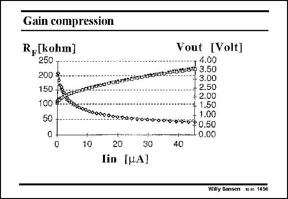

# SANSEN-1456 · Gain compression

章节：14 反馈跨阻放大器与电流放大器  
PDF 页：408；书本页：416；幻灯片编号：1456  
状态：unreviewed



## 对应教材讲解

### PDF 408 · 书本 416

Such transimpedance amplifiers must generate an output signal amplitude which is better by being constant. For a small diode current, a lot of gain is now required, or a large value of feedback resistor R . For a large F input current, a small value of feedback resistor R is F preferred. This gain compression is easily realized with a MOST, rather than with a constant resistor. This is illustrated in this slide. For input currents of 40 mA the resistor R is decreased to about 40 kV such that the output signal is about 1.6 V. A F post amplifier is used with a gain of two, to boost this to 3.2 V. For small input currents, the resistor is over 200 kV and the output signal about 1.5 V.

## 公式／性能结论候选摘录

以下为规则截取的原文，尚未逐项判读。

- PDF 408: For a small diode current, a lot of gain is now required, or a large value of feedback resistor R .
- PDF 408: This gain compression is easily realized with a MOST, rather than with a constant resistor.
- PDF 408: For input currents of 40 mA the resistor R is decreased to about 40 kV such that the output signal is about 1.6 V.
- PDF 408: A F post amplifier is used with a gain of two, to boost this to 3.2 V.

## 曲线结论候选摘录

以下为规则截取的原文，尚未逐项判读。

（未由规则找到；不代表原页没有此类内容。）

## 原文条件与近似候选摘录

以下为规则截取的原文，尚未逐项判读。

（未由规则找到；不代表原页没有此类内容。）

## 幻灯片 OCR（未校正）

```text
Gain compression
R,(kohm]
250
200 g
150
100 k
50
0
10
Vout [Volt]
4.00
CУCA83933-0011-1390511010-648:994
1 3.50
- 3.00
2.50
2.00
• 1.50
- 1.00
900 002000-0 8iiis 050
20
0.00
30
40
lin [uA]
Willy Sansen 10.0s 1456
```

数学上下标、分数及正负号以原图为准。电路图已保留；未核对的连接不输出成可仿真 netlist。
