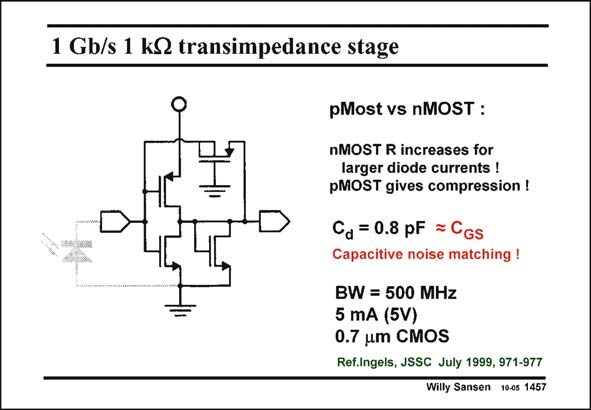

# SANSEN-1457 · 1 Gb/s 1 kQ transimpedance stage

章节：14 反馈跨阻放大器与电流放大器  
PDF 页：409；书本页：417；幻灯片编号：1457  
状态：unreviewed



## 对应教材讲解

### PDF 409 · 书本 417

Compression can also be realized on each gain cell separately. The question arises of whether to realize the feedback resistor with a nMOST or a pMOST transistor? It is shown in this slide that a pMOST should be used as it provides compression for larger input currents. The optimization of such a 4-transistor circuit is a beautiful design project, within a certain CMOS technology. The result given in this slide, show that even in a modest 0.7 mm CMOS technology, 500 MHz can be achieved. Obviously this result depends on the diode capacitance (0.8 pF here). The current is a result of the capacitive noise matching as discussed in Chapter 4.

## 公式／性能结论候选摘录

以下为规则截取的原文，尚未逐项判读。

- PDF 409: Compression can also be realized on each gain cell separately.
- PDF 409: Obviously this result depends on the diode capacitance (0.8 pF here).

## 曲线结论候选摘录

以下为规则截取的原文，尚未逐项判读。

（未由规则找到；不代表原页没有此类内容。）

## 原文条件与近似候选摘录

以下为规则截取的原文，尚未逐项判读。

（未由规则找到；不代表原页没有此类内容。）

## 幻灯片 OCR（未校正）

```text
1 Gb/s 1 kQ transimpedance stage
pMost vs nMOST :
nMOST R increases for
larger diode currents !
pMOST gives compression !
Ca = 0.8 pF = CGs
Capacitive noise matching !
BW = 500 MHz
5 mA (5V)
0.7 um CMOS
Ref.Ingels, JSSC July 1999, 971-977
Willy Sansen 1005 1457
```

数学上下标、分数及正负号以原图为准。电路图已保留；未核对的连接不输出成可仿真 netlist。
