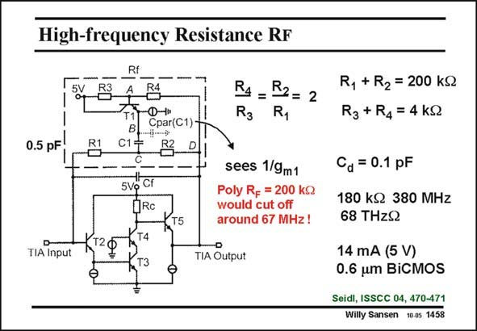

# SANSEN-1458 · High-frequency Resistance RF

章节：14 反馈跨阻放大器与电流放大器  
PDF 页：409；书本页：417；幻灯片编号：1458  
状态：unreviewed



## 对应教材讲解

### PDF 409 · 书本 417

Another way to realize a feedback resistor R at high F frequencies is shown in this slide. It uses the bipolar transistors of a Becomes technology. The transimpedance amplifier itself has an Emitter follower at the input, followed by a cascode amplifier and another Emitter follower, at the output. The feedback resistor R F consists of two resistors R1 and R2 in series, at low frequencies. Together they give a R of 200 kV. Such a poly resistor would cause a −3 dB frequency F of no more than 67 MHz! At high frequencies, capacitor C1 acts as a short circuit. The result is that resistors R3 and R4 take over the role of resistors R1 and R2. They are much smaller in absolute value however, such that they can provide a similar transimpedance up to much higher frequencies. The parasitic capacitance at node B only sees a small 1/g resistance. m1 For a diode capacitance of 0.1 pF, the bandwidth is now 380 MHz. With a transimpedance of 180 kV, this gives an impressive BW.R product of 68 TzV! F

## 公式／性能结论候选摘录

以下为规则截取的原文，尚未逐项判读。

- PDF 409: The parasitic capacitance at node B only sees a small 1/g resistance. m1 For a diode capacitance of 0.1 pF, the bandwidth is now 380 MHz.

## 曲线结论候选摘录

以下为规则截取的原文，尚未逐项判读。

（未由规则找到；不代表原页没有此类内容。）

## 原文条件与近似候选摘录

以下为规则截取的原文，尚未逐项判读。

- PDF 409: They are much smaller in absolute value however, such that they can provide a similar transimpedance up to much higher frequencies.

## 幻灯片 OCR（未校正）

```text
High-frequency Resistance RF
Rf
5V
Ф-»
Cpar(C1)
R4_ R2= 2
R3 R,
0.5 pF
R1
T1
C15
5Vg
Cf
QRC
T4
T5
120
TIA Input
sees 1/9m1
Poly Rg = 200 kg
would cut off
around 67 MHz!
TIA Output
R, + R2 = 200 kQ
R3 + R4= 4 kQ
Ca = 0.1 pF
180 kQ 380 MHz
68 THzQ
14 mA (5 V)
0.6 um BiCMOS
Seidl, ISSCC 04, 470-471
Willy Sansen 10.05 1458
```

数学上下标、分数及正负号以原图为准。电路图已保留；未核对的连接不输出成可仿真 netlist。
