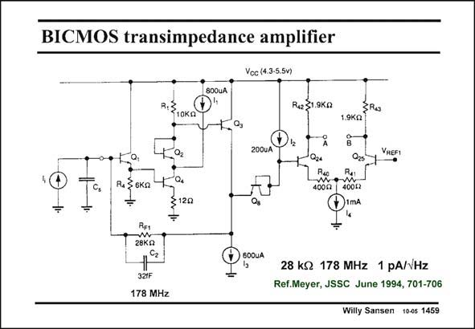

# SANSEN-1459 · BICMOS transimpedance amplifier

章节：14 反馈跨阻放大器与电流放大器  
PDF 页：410；书本页：418；幻灯片编号：1459  
状态：unreviewed



## 对应教材讲解

### PDF 410 · 书本 418

Another shunt-shunt feedback amplifier for optical fiber receivers is shown in this slide. It uses mainly bipolar transistors again. The amplifier itself is preceded by an emitter follower Q1. The amplifier itself consists of transistors Q4 and Q2 with resistors R of 1 10 kV and 12 V. Again an emitter follower is used with Q3 to lower the output resistance. The load resistor R1 is shunted by the input resistance of the emitter follower. As a result, its effective value is only 5 kV. The transconductance of transistor Q4 is about 1/28 V. As a result, the gain of this stage is A =5000/40#125. The v bandwidth is set by the parallel R C , which is 178 MHz. F1 2 More details are given on the next slide. The input resistance will now be R /A #240 V. This is made low to annihilate the effect of F1 v the sensor capacitance C . s The input noise is equally caused by the feedback resistor R and the input base current noise. F1

## 公式／性能结论候选摘录

以下为规则截取的原文，尚未逐项判读。

- PDF 410: As a result, its effective value is only 5 kV.
- PDF 410: As a result, the gain of this stage is A =5000/40#125.
- PDF 410: The v bandwidth is set by the parallel R C , which is 178 MHz.
- PDF 410: This is made low to annihilate the effect of F1 v the sensor capacitance C . s The input noise is equally caused by the feedback resistor R and the input base current noise.

## 曲线结论候选摘录

以下为规则截取的原文，尚未逐项判读。

（未由规则找到；不代表原页没有此类内容。）

## 原文条件与近似候选摘录

以下为规则截取的原文，尚未逐项判读。

（未由规则找到；不代表原页没有此类内容。）

## 幻灯片 OCR（未校正）

```text
BICMOS transimpedance amplifier
Voc (4.3-5.5v)
8OOUA
R.S
Re S1.9ka
1.9KQ
О,.
200UA|
VREFI
• Б.
R.§6ка
÷
$120
REt
28KQ
cz
321F
178 MHz
600UA
28 kS 178 MHz 1 pA//Hz
Ref.Meyer, JSSC June 1994, 701-706
Willy Sansen 10-05 1459
```

数学上下标、分数及正负号以原图为准。电路图已保留；未核对的连接不输出成可仿真 netlist。
