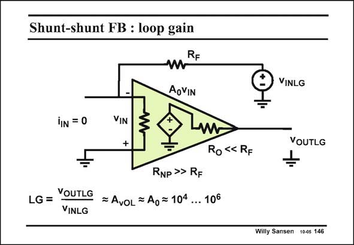

# SANSEN-146 · Shunt-shunt FB : loop gain

章节：14 反馈跨阻放大器与电流放大器  
PDF 页：383；书本页：391；幻灯片编号：146  
状态：unreviewed



## 对应教材讲解

### PDF 383 · 书本 391

There are several places where we can break the loop. We have taken here the output of the amplifier. Now we have to calculate the ratio v /v . OUTLG INLG Remember that we break the loop only for AC performance, whereas the DC conditions are kept the same. Note that the input current source has been assumed to be ideal. It is left out for this calculation. No current can flow through R ; indeed resistor F R is infinite for MOST input devices. As a result, resistor R does not appear in the result. NP F The loop gain is therefore the same as the open-loop gain of the amplifier A . Its value is quite 0 high indeed.

## 公式／性能结论候选摘录

以下为规则截取的原文，尚未逐项判读。

- PDF 383: As a result, resistor R does not appear in the result.
- PDF 383: NP F The loop gain is therefore the same as the open-loop gain of the amplifier A .

## 曲线结论候选摘录

以下为规则截取的原文，尚未逐项判读。

（未由规则找到；不代表原页没有此类内容。）

## 原文条件与近似候选摘录

以下为规则截取的原文，尚未逐项判读。

- PDF 383: Note that the input current source has been assumed to be ideal.

## 幻灯片 OCR（未校正）

```text
Shunt-shunt FB : loop gain
RF
VINLG
AoVIN
iN = 0
VIN
+
VOUTLG
Ro «< RF
RNP >> RF
LG = YOUTLG
= AvoL =Ao = 104
... 106
VINLG
Willy Sansen 10-05 146
```

数学上下标、分数及正负号以原图为准。电路图已保留；未核对的连接不输出成可仿真 netlist。
