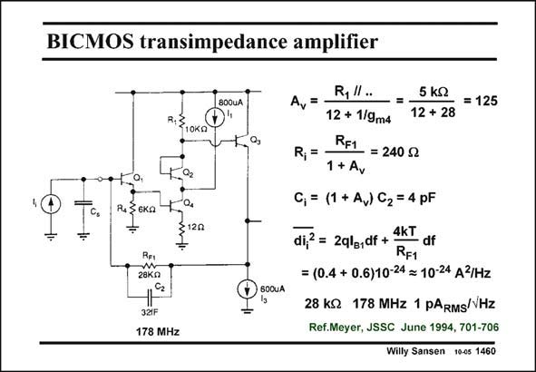

# SANSEN-1460 · BICMOS transimpedance amplifier

章节：14 反馈跨阻放大器与电流放大器  
PDF 页：410；书本页：418；幻灯片编号：1460  
状态：unreviewed



## 对应教材讲解

### PDF 410 · 书本 418

The voltage gain of the input stage is A #125. The v bandwidth is limited by the product R C and is F1 2 178 MHz. The input resistance will thus be R /A F1 v #240 V. This is made low to reduce the effect of the sensor capacitance C , s and to increase the bandwidth to frequencies beyond 178 MHz. The input capacitance is increased by the same amount. It is now 4 pF. The equivalent input noise current is mainly caused by two components. The first one is the base current shot noise of the input bipolar transistor Q1. It is slightly smaller than the current noise of the feedback resistor R . Together it is about 1 pA /√Hz. F1 RMS

## 公式／性能结论候选摘录

以下为规则截取的原文，尚未逐项判读。

- PDF 410: The voltage gain of the input stage is A #125.
- PDF 410: The v bandwidth is limited by the product R C and is F1 2 178 MHz.
- PDF 410: The input resistance will thus be R /A F1 v #240 V.
- PDF 410: This is made low to reduce the effect of the sensor capacitance C , s and to increase the bandwidth to frequencies beyond 178 MHz.
- PDF 410: The input capacitance is increased by the same amount.

## 曲线结论候选摘录

以下为规则截取的原文，尚未逐项判读。

（未由规则找到；不代表原页没有此类内容。）

## 原文条件与近似候选摘录

以下为规则截取的原文，尚未逐项判读。

（未由规则找到；不代表原页没有此类内容。）

## 幻灯片 OCR（未校正）

```text
BICMOS transimpedance amplifier
800UA
R3
10KQ
C,
R430кa
REI
28Kn
600UA
321F
178 MHz
=
R,".
12 + 1/9m4
5 kg
- = 125
12 + 28
R, = -
RF1 = 240 g
1 + Av
C, = (1 + A,) C2 = 4 pF
di,? = 2qle,df + 4KT
RF1
= (0.4 + 0.6)10-24 = 10-24 A3/Hz
28 kQ 178 MHz 1 pARMS/VHz
Ref.Meyer, JSSC June 1994, 701-706
Willy Sansen 10-05 1460
```

数学上下标、分数及正负号以原图为准。电路图已保留；未核对的连接不输出成可仿真 netlist。
