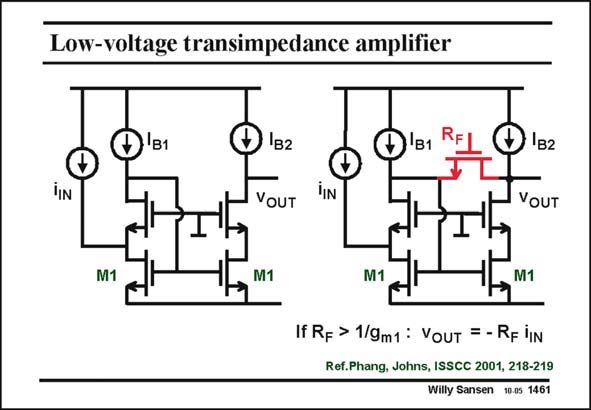

# SANSEN-1461 · Low-voltage transimpedance amplifier

章节：14 反馈跨阻放大器与电流放大器  
PDF 页：411；书本页：419；幻灯片编号：1461  
状态：unreviewed



## 对应教材讲解

### PDF 411 · 书本 419

A transimpedance amplifier for low supply voltages is derived from the differential current amplifier, shown on the left. Only one single transistor has been added to create a transimpedance amplifier, shown on the right. This transistor operates in the linear region, with resistance R . This F resistor provides shuntshunt feedback to the middle node of the current mirror. The input is current source i however, and the IN output is a voltage. It is therefore a transimpedance amplifier! Its transresistance is R itself. F Because of the different feedback arrangement, the input resistance is different from the one without R ; it is R =1/2g , which is still quite low. Since the differential current amplifier can F IN m1 operate at supply voltages below 1 V (see Chapter 3), this transimpedance amplifier can do this as well!

## 公式／性能结论候选摘录

以下为规则截取的原文，尚未逐项判读。

- PDF 411: It is therefore a transimpedance amplifier!

## 曲线结论候选摘录

以下为规则截取的原文，尚未逐项判读。

（未由规则找到；不代表原页没有此类内容。）

## 原文条件与近似候选摘录

以下为规则截取的原文，尚未逐项判读。

（未由规则找到；不代表原页没有此类内容。）

## 幻灯片 OCR（未校正）

```text
Low-voltage transimpedance amplifier
lIN
Đ'B2
YOUT
3'B1
TIN
B2
YOUT
M1
M1
M1
M1
If Rp > 1/gm1: VouT = - RF lN
Ref.Phang, Johns, ISSCC 2001, 218-219
Willy Sansen 10.05 1461
```

数学上下标、分数及正负号以原图为准。电路图已保留；未核对的连接不输出成可仿真 netlist。
