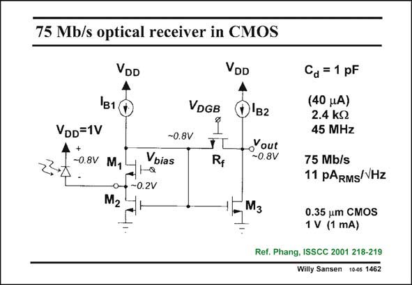

# SANSEN-1462 · 75 Mb/s optical receiver in CMOS

章节：14 反馈跨阻放大器与电流放大器  
PDF 页：411；书本页：419；幻灯片编号：1462  
状态：unreviewed



## 对应教材讲解

### PDF 411 · 书本 419

The actual specifications of the realization are shown in this slide. A photodiode is used with a capacitance of 1 pF. Its maximum input current is about 40 mA. The transimpedance R is 2.4 kV. The F output voltage would then be about 100 mV. The speed is limited by the input node capacitance. The noise is determined by the input devices M and 1 M , and the feedback resis- 2 tor R , as explained before. F

## 公式／性能结论候选摘录

以下为规则截取的原文，尚未逐项判读。

- PDF 411: The speed is limited by the input node capacitance.

## 曲线结论候选摘录

以下为规则截取的原文，尚未逐项判读。

（未由规则找到；不代表原页没有此类内容。）

## 原文条件与近似候选摘录

以下为规则截取的原文，尚未逐项判读。

（未由规则找到；不代表原页没有此类内容。）

## 幻灯片 OCR（未校正）

```text
75 Mb/s optical receiver in CMOS
VDD
VDD
VDGB
O'в2
VDD=1V
4 +
-0.8V Mg
-0-
• ~0.2V
Vbias
-0.8V
FL
.Yout
Ry
-0.8V
_M3
Ca = 1 pF
(40 JA)
2.4 kg
45 MHz
75 Mb/s
11 pARMs/VHz
0.35 um CMOS
1 V (1 mA)
Ref. Phang, ISSCC 2001 218-219
Willy Sansen 1005 1462
```

数学上下标、分数及正负号以原图为准。电路图已保留；未核对的连接不输出成可仿真 netlist。
