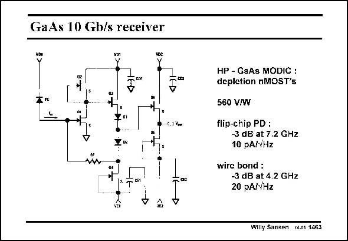

# SANSEN-1463 · GaAs 10 Gb/s receiver

章节：14 反馈跨阻放大器与电流放大器  
PDF 页：412；书本页：420；幻灯片编号：1463  
状态：unreviewed



## 对应教材讲解

### PDF 412 · 书本 420

An example of a transimpedance amplifier for realhigh speed is shown in this slide. It is realized in GaAs technology to achieve the highest possible speed. GaAs FET transistors are depletion devices. They conduct for zero Volt V . GS Transistor Q2 acts as an active load (DC current source) for amplifying transistor Q1. Transistor Q3 is just a Source follower. Two diodes are used for level shifting to be able to close the feedback loop by means of resistor R . The output is taken through another Source follower. F Resistor R is fairly small such that the bandwidth is fairly high. However, this bandwidth F depends on the packaging. Bond wires reduce the bandwidth more than flip-chip packaging!

## 公式／性能结论候选摘录

以下为规则截取的原文，尚未逐项判读。

- PDF 412: F Resistor R is fairly small such that the bandwidth is fairly high.
- PDF 412: However, this bandwidth F depends on the packaging.
- PDF 412: Bond wires reduce the bandwidth more than flip-chip packaging!

## 曲线结论候选摘录

以下为规则截取的原文，尚未逐项判读。

（未由规则找到；不代表原页没有此类内容。）

## 原文条件与近似候选摘录

以下为规则截取的原文，尚未逐项判读。

（未由规则找到；不代表原页没有此类内容。）

## 幻灯片 OCR（未校正）

```text
GaAs 10 Gb/s receiver
VDI
VD1
VDZ
Y
=tca
in
6.1 Vm
+,
HP - GaAs MODIC :
deplction nMOST's
560 V/W
flip-chip PD :
-3 dB at 7.2 GHz
10 pA/Hz
wire bond :
-3 dB at 4.2 GHz
20 pA//Hz
Willy Sansen 10.06 1463
```

数学上下标、分数及正负号以原图为准。电路图已保留；未核对的连接不输出成可仿真 netlist。
