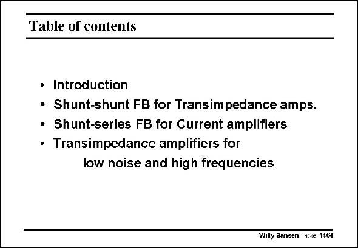

# SANSEN-1464 · Table of contents

章节：14 反馈跨阻放大器与电流放大器  
PDF 页：412；书本页：420；幻灯片编号：1464  
状态：unreviewed



## 对应教材讲解

### PDF 412 · 书本 420

In this Chapter we have learned how to link closedloop gain to open-loop gain and loop gain. Moreover, considerable attention has been paid to the effect of the loop gain on input-and output resistances. In this way we can easily find the pole frequencies caused by capacitances at input and output. This has been done for all four types of feedback amplifiers, in this Chapter and the previous one. In addition, noise and high-frequency considerations have been spelled out on a number of published transimpedance amplifiers. Voltage-input and current-input transimpedance amplifiers have been compared as well. For not too small values of feedback resistor RF, the voltage-input transimpedance amplifier is found to be better for both bandwidth and noise.

## 公式／性能结论候选摘录

以下为规则截取的原文，尚未逐项判读。

- PDF 412: In this Chapter we have learned how to link closedloop gain to open-loop gain and loop gain.
- PDF 412: Moreover, considerable attention has been paid to the effect of the loop gain on input-and output resistances.
- PDF 412: For not too small values of feedback resistor RF, the voltage-input transimpedance amplifier is found to be better for both bandwidth and noise.

## 曲线结论候选摘录

以下为规则截取的原文，尚未逐项判读。

（未由规则找到；不代表原页没有此类内容。）

## 原文条件与近似候选摘录

以下为规则截取的原文，尚未逐项判读。

（未由规则找到；不代表原页没有此类内容。）

## 幻灯片 OCR（未校正）

```text
Table of contents
• Introduction
• Shunt-shunt FB for Transimpedance amps.
• Shunt-series FB for Current amplifiers
• Transimpedance amplifiers for
low noise and high frequencies
Willy Sansen 10.0s 1464
```

数学上下标、分数及正负号以原图为准。电路图已保留；未核对的连接不输出成可仿真 netlist。
