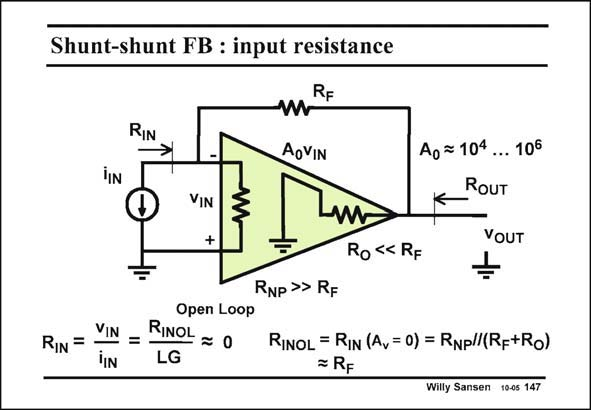

# SANSEN-147 · Shunt-shunt FB : input resistance

章节：14 反馈跨阻放大器与电流放大器  
PDF 页：384；书本页：392；幻灯片编号：147  
状态：unreviewed



## 对应教材讲解

### PDF 384 · 书本 392

Now it is easy to calculate the input resistance R , IN seen by the current input sensor. By definition, the closed-loop input resistance R equals the input resis- IN tance without feedback, divided by the loop gain. Be aware that the ‘‘input resistance without feedback’’ has to include the components that we use to carry out the feedback. Resistor R car- F ries out the feedback and must be included when we calculate the open-loop input resistance R . INOL This resistance is two resistors in parallel. For a MOST, in which R is really high, the open- NP loop input resistance is mainly R itself. For a bipolar transistor, it would be two resistors F in parallel The closed-loop input resistance R is R divided by the loop gain; its value will be quite IN F small, not to say zero.

## 公式／性能结论候选摘录

以下为规则截取的原文，尚未逐项判读。

- PDF 384: By definition, the closed-loop input resistance R equals the input resis- IN tance without feedback, divided by the loop gain.
- PDF 384: For a bipolar transistor, it would be two resistors F in parallel The closed-loop input resistance R is R divided by the loop gain; its value will be quite IN F small, not to say zero.

## 曲线结论候选摘录

以下为规则截取的原文，尚未逐项判读。

（未由规则找到；不代表原页没有此类内容。）

## 原文条件与近似候选摘录

以下为规则截取的原文，尚未逐项判读。

（未由规则找到；不代表原页没有此类内容。）

## 幻灯片 OCR（未校正）

```text
Shunt-shunt FB : input resistance
RIN
RF
AoVIN
VIN
+
W.
Ao = 104
... 106
RoUT
VOUT
Ro «< RF
RIN =
Open Loop
VIN
=-
RINOL = 0
iIN
LG
RNP >> RF
RINOL = RIN (Av = 0) = Rnpl/(Rp+Ro)
= RF
Willy Sansen 10-05 147
```

数学上下标、分数及正负号以原图为准。电路图已保留；未核对的连接不输出成可仿真 netlist。
