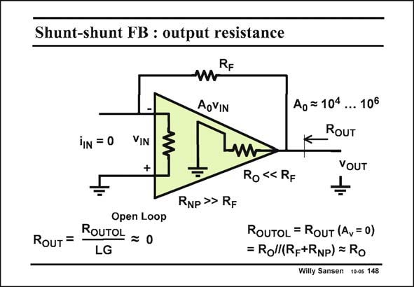

# SANSEN-148 · Shunt-shunt FB : output resistance

章节：14 反馈跨阻放大器与电流放大器  
PDF 页：384；书本页：392；幻灯片编号：148  
状态：unreviewed



## 对应教材讲解

### PDF 384 · 书本 392

The output resistance is readily calculated in a similar way. The closed-loop output resistance R OUT equals the output resistance without feedback, divided by the loop gain. Remember that the ‘‘output resistance without feedback’’ has to include the components that we use to carry out the feedback. Resistor R carries out F the feedback and must be included again when we calculate the open-loop output resistance R . This time OUTOL however, it does not make much difference as the output resistor R is much smaller than R . 0 F The open-loop output resistance R is mainly R itself. OUTOL 0 The closed-loop output resistance is now much smaller as it is the output resistor R divided 0 by the loop gain LG. This amplifier therefore functions as a voltage source.

## 公式／性能结论候选摘录

以下为规则截取的原文，尚未逐项判读。

- PDF 384: The closed-loop output resistance R OUT equals the output resistance without feedback, divided by the loop gain.
- PDF 384: OUTOL 0 The closed-loop output resistance is now much smaller as it is the output resistor R divided 0 by the loop gain LG.
- PDF 384: This amplifier therefore functions as a voltage source.

## 曲线结论候选摘录

以下为规则截取的原文，尚未逐项判读。

（未由规则找到；不代表原页没有此类内容。）

## 原文条件与近似候选摘录

以下为规则截取的原文，尚未逐项判读。

- PDF 384: This time OUTOL however, it does not make much difference as the output resistor R is much smaller than R . 0 F The open-loop output resistance R is mainly R itself.
- PDF 384: OUTOL 0 The closed-loop output resistance is now much smaller as it is the output resistor R divided 0 by the loop gain LG.

## 幻灯片 OCR（未校正）

```text
Shunt-shunt FB : output resistance
RF
AoVIN
iIN = 0
VIN
+
Ao =104
...106
RoUT
VOUT
Ro «< RF
=
Open Loop
RouT =
ROUTOL = 0
LG
RNP >> RF
ROUTOL = RoUT (Av= 0)
= Roll(Rp+RNp) = Ro
Willy Sansen 10-05 148
```

数学上下标、分数及正负号以原图为准。电路图已保留；未核对的连接不输出成可仿真 netlist。
