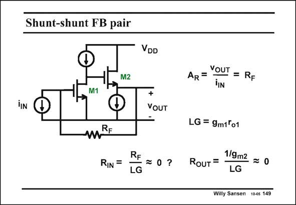

# SANSEN-149 · Shunt-shunt FB pair

章节：14 反馈跨阻放大器与电流放大器  
PDF 页：385；书本页：393；幻灯片编号：149  
状态：unreviewed



## 对应教材讲解

### PDF 385 · 书本 393

A transistor example of such a shunt-shunt feedback amplifier is shown in this slide. The open-loop amplifier consists of a single-transistor amplifier followed by a source-follower, in order to provide a low output resistance. Its value is 1/g . m2 The gain of the amplifier is readily found to be g r , m1 o1 which is again the loop gain. This loop gain LG is not so large. Its value is barely 100 and yet, all feedback rules still apply. The closed-loop input resistance is now R divided by the loop gain. Output resistor 1/g is F m2 obviously negligible with respect to R . F The closed-loop output resistance is then 1/g divided by the loop gain. It is now very small, m2 or quasi zero.

## 公式／性能结论候选摘录

以下为规则截取的原文，尚未逐项判读。

- PDF 385: Its value is 1/g . m2 The gain of the amplifier is readily found to be g r , m1 o1 which is again the loop gain.
- PDF 385: This loop gain LG is not so large.
- PDF 385: The closed-loop input resistance is now R divided by the loop gain.
- PDF 385: F The closed-loop output resistance is then 1/g divided by the loop gain.

## 曲线结论候选摘录

以下为规则截取的原文，尚未逐项判读。

（未由规则找到；不代表原页没有此类内容。）

## 原文条件与近似候选摘录

以下为规则截取的原文，尚未逐项判读。

（未由规则找到；不代表原页没有此类内容。）

## 幻灯片 OCR（未校正）

```text
Shunt-shunt FB pair
VDD
M2
M1
+
VOUT
mRE
RIN =
RF
=0?
LG
AR = YOUT = RF
IIN
LG = 9m1ºo1
RouT =
1/9m2 = 0
LG
Willy Sansen 10-05 149
```

数学上下标、分数及正负号以原图为准。电路图已保留；未核对的连接不输出成可仿真 netlist。
