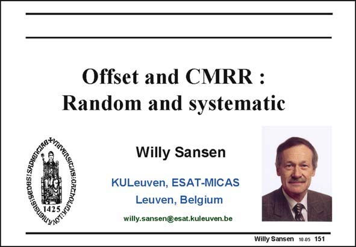

# SANSEN-151 · Slide 151

章节：15 失调与共模抑制比：随机误差及系统误差  
PDF 页：413；书本页：421；幻灯片编号：151  
状态：unreviewed



## 对应教材讲解

### PDF 413 · 书本 421

The main limitation to precision in analog integrated circuits is established by noise and mismatch. Actually, the smaller the channel lengths become, the more severe is the mismatch and this becomes the dominant limitation in precision. Mismatch is the main reason for high offset and low CMRR (Commonmode rejection ratio). It is also the main reason for low PSRR (Power-supply rejection ratio). In this Chapter we will investigate the relationship between mismatch and these specifications. Moreover, we will try to find out how to modify the layout of a circuit to improve mismatch and hence to lower the offset. This will be done for both CMOS and bipolar technologies.

## 公式／性能结论候选摘录

以下为规则截取的原文，尚未逐项判读。

- PDF 413: The main limitation to precision in analog integrated circuits is established by noise and mismatch.
- PDF 413: Actually, the smaller the channel lengths become, the more severe is the mismatch and this becomes the dominant limitation in precision.

## 曲线结论候选摘录

以下为规则截取的原文，尚未逐项判读。

（未由规则找到；不代表原页没有此类内容。）

## 原文条件与近似候选摘录

以下为规则截取的原文，尚未逐项判读。

（未由规则找到；不代表原页没有此类内容。）

## 幻灯片 OCR（未校正）

```text
Offset and CMRR:
Random and systematic
Willy Sansen
KULeuven, ESAT-MICAS
Leuven, Belgium
willy.sansen@esat.kuleuven.be
Willy Sansen 1005 151
```

数学上下标、分数及正负号以原图为准。电路图已保留；未核对的连接不输出成可仿真 netlist。
