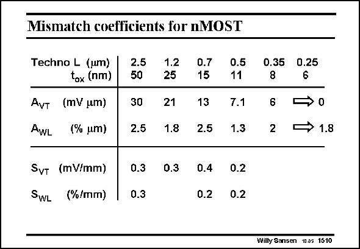

# SANSEN-1510 · Mismatch coefficients for nMOST

章节：15 失调与共模抑制比：随机误差及系统误差  
PDF 页：417；书本页：425；幻灯片编号：1510  
状态：unreviewed



## 对应教材讲解

### PDF 417 · 书本 425

Some more data is given next. It is clearly seen that the A continues to decrease VT for smaller channel lengths but not A . The latter WL parameter seems to stabilize around 2%mm. This means that if the spreading on the threshold is the main contributor to mismatch, then spreading in sizing may become the dominant one in the future. Two more parameters are introduced below. The first

### PDF 418 · 书本 426

one is S . It indicates the spreading of the threshold voltage V for two transistors separated VT T by a distance of 1 mm. Values are given for some older technologies but not for more recent ones. The reason is that CMOS processing is now carried out on large wafers (of 12 inch and more) such that homogeneity has been strongly improved. Spreading on such short distances of 1 mm has therefore become negligible. The same applies to the other factor S . WL

## 公式／性能结论候选摘录

以下为规则截取的原文，尚未逐项判读。

- PDF 417: It is clearly seen that the A continues to decrease VT for smaller channel lengths but not A .
- PDF 418: Spreading on such short distances of 1 mm has therefore become negligible.

## 曲线结论候选摘录

以下为规则截取的原文，尚未逐项判读。

（未由规则找到；不代表原页没有此类内容。）

## 原文条件与近似候选摘录

以下为规则截取的原文，尚未逐项判读。

（未由规则找到；不代表原页没有此类内容。）

## 幻灯片 OCR（未校正）

```text
Mismatch coefficients for nMOST
Techno L (um)
tox (nm)
AvT (mV um)
AwL (% um)
SvT (mV/mm)
SWL
(%/mm)
2.5
50
30
2.5
0.3
0.3
1.2
25
21
1.8
D.3
0.7
15
13
2.5
0.4
0.2
0.5
11
7.1
1.3
0.2
0.2
0.35
8
6
2
0.25
6
→ 1.8
Willy Sansen 10-05 1510
```

数学上下标、分数及正负号以原图为准。电路图已保留；未核对的连接不输出成可仿真 netlist。
