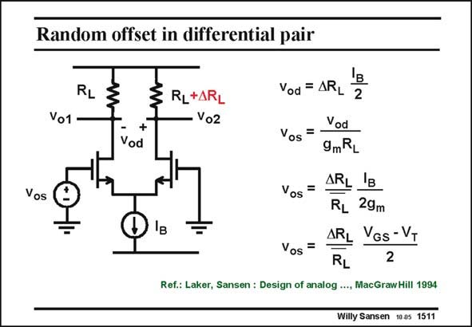

# SANSEN-1511 · Random offset in differential pair

章节：15 失调与共模抑制比：随机误差及系统误差  
PDF 页：418；书本页：426；幻灯片编号：1511  
状态：unreviewed



## 对应教材讲解

### PDF 418 · 书本 426

Note that several sources of parameter spreading have been identified, we can try to establish their relationship with the offset. A simple differential pair is taken first, in which the only source of asymmetry is the spreading in load resistor RL. This will result in a differential output voltage v and therefore into an od offset voltage. It is calculated in this slide. The differential output voltage v is readily calcuod lated, as both transistors carry an equal current I /2. This v divided by the small-signal gain B od g R gives the differential input voltage required to make the differential output voltage zero, m L which is by definition the offset voltage v . os The final result for the offset voltage v shows that the input transistors must be designed for os high gain, which means they must be designed for small V −V . GS T Pushing them into a weak inversion would make the offset voltage even smaller! Indeed for a weak inversion factor (V −V )/2 it can be substituted by nkT/q, which is always smaller. GS T

## 公式／性能结论候选摘录

以下为规则截取的原文，尚未逐项判读。

- PDF 418: This will result in a differential output voltage v and therefore into an od offset voltage.
- PDF 418: The differential output voltage v is readily calcuod lated, as both transistors carry an equal current I /2.
- PDF 418: This v divided by the small-signal gain B od g R gives the differential input voltage required to make the differential output voltage zero, m L which is by definition the offset voltage v . os The final result for the offset voltage v shows that the input transistors must be designed for os high gain, which means they must be designed for small V −V .

## 曲线结论候选摘录

以下为规则截取的原文，尚未逐项判读。

（未由规则找到；不代表原页没有此类内容。）

## 原文条件与近似候选摘录

以下为规则截取的原文，尚未逐项判读。

（未由规则找到；不代表原页没有此类内容。）

## 幻灯片 OCR（未校正）

```text
Random offset in differential pair
RL
Vo1
RL+ARL
Vo2
+
Vod
Vos
Vod = ARL 2
Vod
Vos
=
9mRL
Vos=
ARL IB
RL 29m
ARL Vgs-VT
Vos =
2
Ref.: Laker, Sansen : Design of analog ..., MacGraw Hill 1994
Willy Sansen 10a5 1511
```

数学上下标、分数及正负号以原图为准。电路图已保留；未核对的连接不输出成可仿真 netlist。
