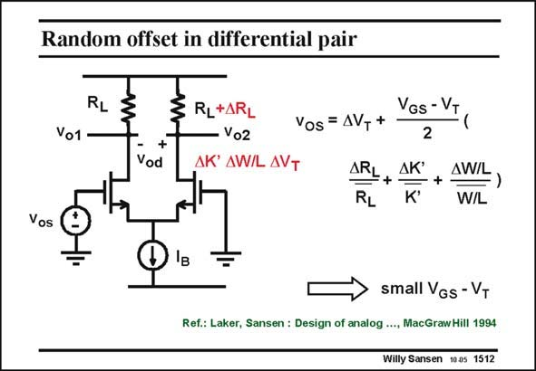

# SANSEN-1512 · Random offset in differential pair

章节：15 失调与共模抑制比：随机误差及系统误差  
PDF 页：418；书本页：426；幻灯片编号：1512  
状态：unreviewed



## 对应教材讲解

### PDF 418 · 书本 426

A similar calculation can be carried out for the other delta’s. The easiest one to understand is the one for the spreading in V . This one T simply appears at the input of the differential pair. This is why it can simply be added to the offset voltage v . os The resulting expression contains four terms. Since all of them can have both positive and negative values, they never all add up. Such

### PDF 419 · 书本 427

a worst case never occurs in practice. They never cancel out either. Three of them are scaled by (V −V )/2. The offset can now be reduced by designing the GS T transistors with small values of V −V , or by pushing them into weak inversion. GS T Note that trimming the resistors allows it to compensate for all other terms. It is clear however, that this cancellation point depends on the stability of the biasing point (through V −V ) with GS T respect to other biasing and supply voltages and with respect to temperature. This is exceedingly difficult to realize in practice. Trimming of the offset voltage for MOSTs is therefore a real problem.

## 公式／性能结论候选摘录

以下为规则截取的原文，尚未逐项判读。

- PDF 419: It is clear however, that this cancellation point depends on the stability of the biasing point (through V −V ) with GS T respect to other biasing and supply voltages and with respect to temperature.
- PDF 419: Trimming of the offset voltage for MOSTs is therefore a real problem.

## 曲线结论候选摘录

以下为规则截取的原文，尚未逐项判读。

（未由规则找到；不代表原页没有此类内容。）

## 原文条件与近似候选摘录

以下为规则截取的原文，尚未逐项判读。

（未由规则找到；不代表原页没有此类内容。）

## 幻灯片 OCR（未校正）

```text
Random offset in differential pair
RL
Vo1
+
Vod
RL+ARL
Vo2
AK' AW/L AVT
Vos= AVT+
ARL
RL
VGs - VT
2
ДК'
K*
+
AW/L
W/L
Vos
small VGs - VT
Ref.: Laker, Sansen : Design of analog …, MacGraw Hill 1994
Willy Sansen 10a5 1512
```

数学上下标、分数及正负号以原图为准。电路图已保留；未核对的连接不输出成可仿真 netlist。
