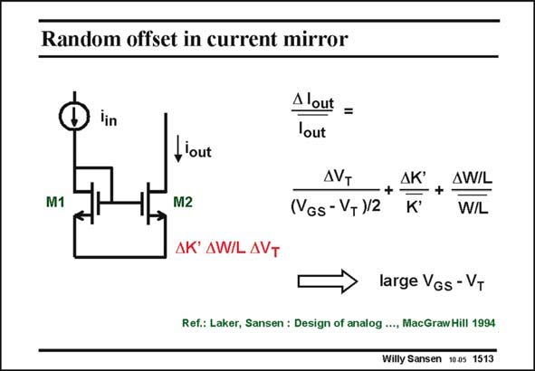

# SANSEN-1513 · Random offset in current mirror

章节：15 失调与共模抑制比：随机误差及系统误差  
PDF 页：419；书本页：427；幻灯片编号：1513  
状态：unreviewed



## 对应教材讲解

### PDF 419 · 书本 427

Two matched transistors are also used in current mirrors. The difference with a differential pair however, is that we now have to concentrate on the output currents, rather than on the differential input voltage. The relative spreading on the output current depends again on the transistor parameter spreadings. It is easy to understand that when one transistor is 1% larger than the other one, the currents differ accordingly. This time the spreading in threshold voltage must be scaled by (V −V )/2. GS T This leads to the conclusion that current source transistors are well matched if they have been designed for large value of V −V . In this case, the A is the dominant source of mismatch. GS T WL Remember that this one does not scale with technology.

## 公式／性能结论候选摘录

以下为规则截取的原文，尚未逐项判读。

- PDF 419: The relative spreading on the output current depends again on the transistor parameter spreadings.
- PDF 419: GS T This leads to the conclusion that current source transistors are well matched if they have been designed for large value of V −V .

## 曲线结论候选摘录

以下为规则截取的原文，尚未逐项判读。

（未由规则找到；不代表原页没有此类内容。）

## 原文条件与近似候选摘录

以下为规则截取的原文，尚未逐项判读。

（未由规则找到；不代表原页没有此类内容。）

## 幻灯片 OCR（未校正）

```text
Random offset in current mirror
iin
Alout =
lout
M1
L'out
M2
AK' AW/L AVT
AVT
(VGs - VT)/2
AK
K*
AW/L
W/L
large VGs- VT
Ref.: Laker, Sansen : Design of analog …., MacGraw Hill 1994
Willy Sansen 1005 1513
```

数学上下标、分数及正负号以原图为准。电路图已保留；未核对的连接不输出成可仿真 netlist。
