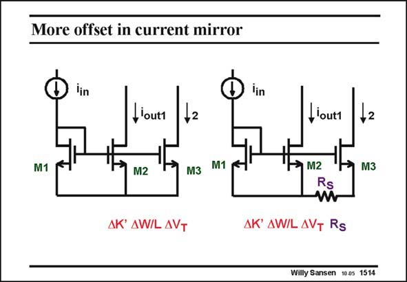

# SANSEN-1514 · More offset in current mirror

章节：15 失调与共模抑制比：随机误差及系统误差  
PDF 页：419；书本页：427；幻灯片编号：1514  
状态：unreviewed



## 对应教材讲解

### PDF 419 · 书本 427

Note however, that current mirrors, which are used for biasing, may have errors in the output currents, caused by resistances in the supply lines. On the left such a current mirror is shown. It is duplicated on the right with some series resistance R in S the supply line. The output current I out2 will be decreased because a voltage drop R I has to S out2 be subtracted from its V . GS2 This voltage drop must always be subtracted. It is

### PDF 420 · 书本 428

now a systematic error, not a random one. More systematic spreadings will be discussed later.

## 公式／性能结论候选摘录

以下为规则截取的原文，尚未逐项判读。

- PDF 419: The output current I out2 will be decreased because a voltage drop R I has to S out2 be subtracted from its V .

## 曲线结论候选摘录

以下为规则截取的原文，尚未逐项判读。

（未由规则找到；不代表原页没有此类内容。）

## 原文条件与近似候选摘录

以下为规则截取的原文，尚未逐项判读。

（未由规则找到；不代表原页没有此类内容。）

## 幻灯片 OCR（未校正）

```text
More offset in current mirror
lin
iin
louti
,lout1
M1
M1
M2
M2
M3
M3
Rs
AK' AW/L AVT
AW/L AVT
Rs
Willy Sansen 1005 1514
```

数学上下标、分数及正负号以原图为准。电路图已保留；未核对的连接不输出成可仿真 netlist。
