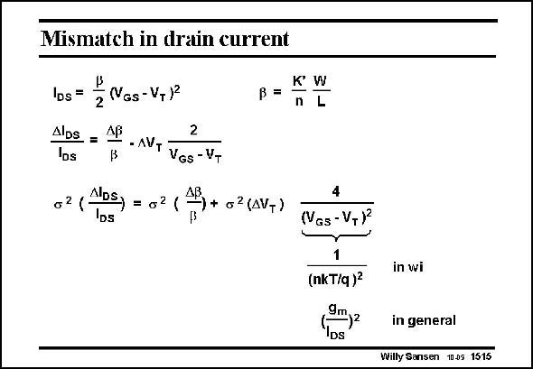

# SANSEN-1515 · Mismatch in drain current

章节：15 失调与共模抑制比：随机误差及系统误差  
PDF 页：420；书本页：428；幻灯片编号：1515  
状态：unreviewed



## 对应教材讲解

### PDF 420 · 书本 428

The spreading on the total drain current contains both the spreading on the beta and the spreading on the threshold voltage V , but in T a different way. The spreadings on K∞ and on W/L are taken up by the spreading on beta for simplicity. Taking the derivatives allows us to calculate the total effective spreading on the drain current I . It is DS clear that for large values of V −V , the spreading in GS T beta is dominant. This is the case for a current mirror. For small values of V −V however, the spreading in threshold voltage may be dominant GS T depending on the actual values, which depend on the actual sizes used. This also applies to transistors biased in weak inversion. For weak inversion the term (V −V )/2 has to be substituted by nkT/q. Remember that these terms are nothing more than GS T the g /I values of the transistor, independent of weak or strong inversion. m DS A plot version weak inversion coefficient is shown next.

## 公式／性能结论候选摘录

以下为规则截取的原文，尚未逐项判读。

- PDF 420: For small values of V −V however, the spreading in threshold voltage may be dominant GS T depending on the actual values, which depend on the actual sizes used.
- PDF 420: Remember that these terms are nothing more than GS T the g /I values of the transistor, independent of weak or strong inversion. m DS A plot version weak inversion coefficient is shown next.

## 曲线结论候选摘录

以下为规则截取的原文，尚未逐项判读。

- PDF 420: Remember that these terms are nothing more than GS T the g /I values of the transistor, independent of weak or strong inversion. m DS A plot version weak inversion coefficient is shown next.

## 原文条件与近似候选摘录

以下为规则截取的原文，尚未逐项判读。

（未由规则找到；不代表原页没有此类内容。）

## 幻灯片 OCR（未校正）

```text
Mismatch in drain current
los = E Nas-V+ 1
Nos - •AVr Vos-V
B =
62 (
ADS, = 021
Ds
+ o2 (AV,)
K W
n L
(VGs - V,)
in wi
(nk T/q )*
9m
DS
in general
Willy Sansen 10.05 1515
```

数学上下标、分数及正负号以原图为准。电路图已保留；未核对的连接不输出成可仿真 netlist。
