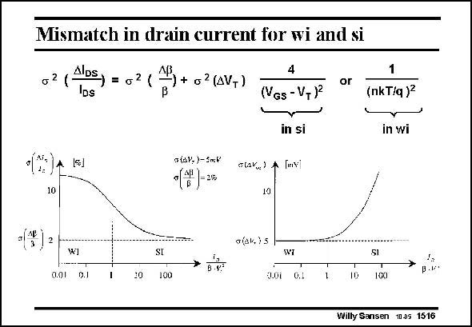

# SANSEN-1516 · Mismatch in drain current for wi and si

章节：15 失调与共模抑制比：随机误差及系统误差  
PDF 页：420；书本页：428；幻灯片编号：1516  
状态：unreviewed



## 对应教材讲解

### PDF 420 · 书本 428

A plot of the mismatch of the drain current version weak inversion coefficient is shown below. This is the ratio of the drain current to the si/wi transition current (see Chapter 1). In terms of beta, this transition current is about 2nb(kT/q)2 or 0.002 b. Note that V =kT/q. t It is clear that for weak inversion the spreading in threshold voltage is dominant. For strong inversion, the spreading in beta is dominant, most probably due to the spreading in W and L values, whichever is smaller.

### PDF 421 · 书本 429

The crossover region is quite large however, as can be expected near the cross-over between weak and strong inversion (explained in Chapter 1).

## 公式／性能结论候选摘录

以下为规则截取的原文，尚未逐项判读。

（未由规则找到；不代表原页没有此类内容。）

## 曲线结论候选摘录

以下为规则截取的原文，尚未逐项判读。

- PDF 420: A plot of the mismatch of the drain current version weak inversion coefficient is shown below.

## 原文条件与近似候选摘录

以下为规则截取的原文，尚未逐项判读。

（未由规则找到；不代表原页没有此类内容。）

## 幻灯片 OCR（未校正）

```text
Mismatch in drain current for wi and si
AIDS
IDs
+ o 2 (AVT)
(sJ
a (aV.)- 3mV
(7)-2%
10
4
(VGs - V,Pº
in si
a(ar) A Imy
10
or
1
(nkT/q)
in wi
q(дk,) 5
W1
0.01 9.1
10
SI
100
WT
201 0.1
10
SI
100
p.r'
Willy Sansen 1005 1516
```

数学上下标、分数及正负号以原图为准。电路图已保留；未核对的连接不输出成可仿真 netlist。
