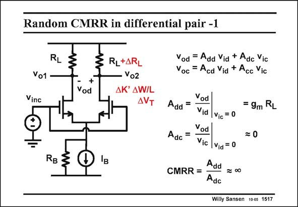

# SANSEN-1517 · Random CMRR in differential pair -1

章节：15 失调与共模抑制比：随机误差及系统误差  
PDF 页：421；书本页：429；幻灯片编号：1517  
状态：unreviewed



## 对应教材讲解

### PDF 421 · 书本 429

Besides the offset voltage, a differential pair has another specification, which also reflects the influences of the spreadings. It is the CMRR or Common-mode Rejection Ratio. Remember (from Chapter 3) that a differential pair has two inputs, which are better converted into a differential input v and a id common-mode (or average) input v . The same applies ic to the outputs. In this way insight can be built up about the actual operation. As a result, we find four different gains. Up till now we have concentrated on the differentialto-differential gain A . This gain is easy to calculate as it is the differential output voltage v dd od obtained for a differential input voltage v , when the common-mode input voltage v is zero. id ic In this case the differential-to-common-mode gain A does not play a role. dc If the differential pair is driven with a common-mode voltage however, the gain A may come dc in. It is defined as the differential output voltage v obtained for a common-mode input voltage od v , when the differential input voltage v is zero. This situation is sketched in this slide. A ic id common-mode input voltage v is applied and the differential output voltage v is measured. inc od The ratio of the two gains is the CMRR. It is infinity if gain A (and not A !) is zero. Note dc cc also that the CMRR does not play a role for a purely differential drive (v =0). ic

## 公式／性能结论候选摘录

以下为规则截取的原文，尚未逐项判读。

- PDF 421: As a result, we find four different gains.
- PDF 421: Up till now we have concentrated on the differentialto-differential gain A .
- PDF 421: This gain is easy to calculate as it is the differential output voltage v dd od obtained for a differential input voltage v , when the common-mode input voltage v is zero. id ic In this case the differential-to-common-mode gain A does not play a role. dc If the differential pair is driven with a common-mode voltage however, the gain A may come dc in.
- PDF 421: It is infinity if gain A (and not A !) is zero.

## 曲线结论候选摘录

以下为规则截取的原文，尚未逐项判读。

（未由规则找到；不代表原页没有此类内容。）

## 原文条件与近似候选摘录

以下为规则截取的原文，尚未逐项判读。

（未由规则找到；不代表原页没有此类内容。）

## 幻灯片 OCR（未校正）

```text
Random CMRR in differential pair -1
RL
Vo1
Vinc
+
Vod
RL+ARL
Vo2
ДK' AW/L
AVT
RB 3
Iв
Vod = Add Vid + Adc Vic
Voc = Acd Vid + Acc Vic
Vod
Add =
Vid
Vic = 0
Vod
Adc
=
Vic
Vid = 0
Add
CMRR =
Adc
= 9m RL
= 0
Willy Sansen 100s 1517
```

数学上下标、分数及正负号以原图为准。电路图已保留；未核对的连接不输出成可仿真 netlist。
