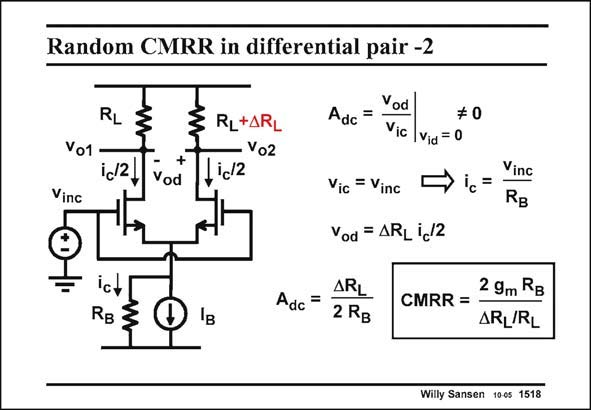

# SANSEN-1518 · Random CMRR in differential pair -2

章节：15 失调与共模抑制比：随机误差及系统误差  
PDF 页：422；书本页：430；幻灯片编号：1518  
状态：unreviewed



## 对应教材讲解

### PDF 421 · 书本 429

In order to calculate the CMRR, we need to calculate the gain A . A common-mode input dc voltage v is then applied and the differential output voltage v is measured. inc od It is clear that no differential output voltage v can be detected if no delta’s occur. Both input od Gates and the common-Source point carry the same signal. The currents in both transistors are now the same and for equal load resistors R the output voltages are also the same. The L differential output voltage is then zero. Let us assume that a difference in load resistor is now present. Both transistors are still equal. In this, case the input voltage v causes a small current i to flow through the output resistance inc c R of the current source. This current is divided equally through both transistors and reaches B

### PDF 422 · 书本 430

the output resistors. A differential output voltage v thus develops as given in od this slide. Gain A is thus dc readily obtained. Division by the differential gain g R , yields the m L CMRR. It is clear that the CMRR depends on the output resistance of the current source. It can be made large by use of cascodes. As an example, for a g R m B of 30 and a DR /R of 1%, L L the CMRR is about 6000 or 75 dB.

## 公式／性能结论候选摘录

以下为规则截取的原文，尚未逐项判读。

- PDF 421: In order to calculate the CMRR, we need to calculate the gain A .
- PDF 421: The currents in both transistors are now the same and for equal load resistors R the output voltages are also the same.
- PDF 421: Both transistors are still equal.
- PDF 421: This current is divided equally through both transistors and reaches B
- PDF 422: A differential output voltage v thus develops as given in od this slide.
- PDF 422: Gain A is thus dc readily obtained.
- PDF 422: Division by the differential gain g R , yields the m L CMRR.
- PDF 422: It is clear that the CMRR depends on the output resistance of the current source.

## 曲线结论候选摘录

以下为规则截取的原文，尚未逐项判读。

（未由规则找到；不代表原页没有此类内容。）

## 原文条件与近似候选摘录

以下为规则截取的原文，尚未逐项判读。

- PDF 421: Let us assume that a difference in load resistor is now present.

## 幻灯片 OCR（未校正）

```text
Random CMRR in differential pair -2
RL
Vo1
ic2,
+
Vod
RL+AR
Vo2
ic12
Vinc
Vod
Adc =
#0
Vic |Vid=0
Vic = Vinc
ic
Vod = ARL i_/2
Vinc
RB
ict
RB
Iв
Adc
=
ARL
2 RB
CMRR =
2 9m RB
ARL/RL
Willy Sansen 100s 1518
```

数学上下标、分数及正负号以原图为准。电路图已保留；未核对的连接不输出成可仿真 netlist。
