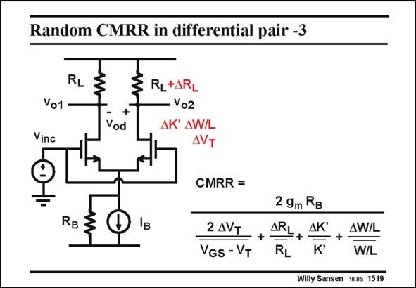

# SANSEN-1519 · Random CMRR in differential pair -3

章节：15 失调与共模抑制比：随机误差及系统误差  
PDF 页：422；书本页：430；幻灯片编号：1519  
状态：unreviewed



## 对应教材讲解

### PDF 422 · 书本 430

If all other parameter spreadings are included, an expression is found for the CMRR as shown in this slide. Note again that we find four terms, which add up algebraically. The sum is never reached and neither is an average of zero. The same combination of terms is found as for the offset. There must therefore be a simple relationship between offset and CMRR, as shown next.

## 公式／性能结论候选摘录

以下为规则截取的原文，尚未逐项判读。

- PDF 422: There must therefore be a simple relationship between offset and CMRR, as shown next.

## 曲线结论候选摘录

以下为规则截取的原文，尚未逐项判读。

（未由规则找到；不代表原页没有此类内容。）

## 原文条件与近似候选摘录

以下为规则截取的原文，尚未逐项判读。

（未由规则找到；不代表原页没有此类内容。）

## 幻灯片 OCR（未校正）

```text
Random CMRR in differential pair -3
RL
Vo1
Vinc
+
Vod
RL+ARL
Vo2
AK AW/L
AVT
CMRR =
RB
Iв
2 AVT
VGS - VT
2 9m RB
ARL
AK
RL
AW/L
+
W/L
Willy Sansen 1005 1519
```

数学上下标、分数及正负号以原图为准。电路图已保留；未核对的连接不输出成可仿真 netlist。
