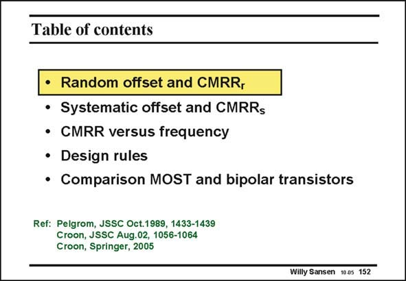

# SANSEN-152 · Table of contents

章节：15 失调与共模抑制比：随机误差及系统误差  
PDF 页：413；书本页：421；幻灯片编号：152  
状态：unreviewed



## 对应教材讲解

### PDF 413 · 书本 421

First of all, we start by a few definitions. What is actually offset and what is CMRR? They can be caused by random effects but also by systematic errors in design. We now focus on how these phenomena behave at higher frequencies. Probably the most important part of this Chapter is the list of design rules for good design. Finally, the differences are highlighted between CMOS and bipolar design.

## 公式／性能结论候选摘录

以下为规则截取的原文，尚未逐项判读。

（未由规则找到；不代表原页没有此类内容。）

## 曲线结论候选摘录

以下为规则截取的原文，尚未逐项判读。

（未由规则找到；不代表原页没有此类内容。）

## 原文条件与近似候选摘录

以下为规则截取的原文，尚未逐项判读。

（未由规则找到；不代表原页没有此类内容。）

## 幻灯片 OCR（未校正）

```text
Table of contents
• Random offset and CMRR,
• Systematic offset and CMRRs
• CMRR versus frequency
• Design rules
• Comparison MOST and bipolar transistors
Ref: Pelgrom, JSSC Oct.1989, 1433-1439
Croon, JSSC Aug.02, 1056-1064
Croon, Springer, 2005
Willy Sansen 1005 152
```

数学上下标、分数及正负号以原图为准。电路图已保留；未核对的连接不输出成可仿真 netlist。
