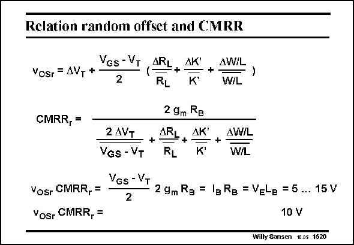

# SANSEN-1520 · Relation random offset and CMRR

章节：15 失调与共模抑制比：随机误差及系统误差  
PDF 页：423；书本页：431；幻灯片编号：1520  
状态：unreviewed



## 对应教材讲解

### PDF 423 · 书本 431

Copying the expressions of the random offset and the CMRR shows that their product cancels out all the delta terms. Moreover, the product can be simplified as the input devices are involved in an obvious way, and also the current source transistor. The resulting parameter is merely the Early Voltage V L of the current source. E B Its value depends on the channel length L chosen. If B an average value for V L E B is taken of about 10 V, then some important conclusions can be drawn.

## 公式／性能结论候选摘录

以下为规则截取的原文，尚未逐项判读。

- PDF 423: E B Its value depends on the channel length L chosen.

## 曲线结论候选摘录

以下为规则截取的原文，尚未逐项判读。

（未由规则找到；不代表原页没有此类内容。）

## 原文条件与近似候选摘录

以下为规则截取的原文，尚未逐项判读。

（未由规则找到；不代表原页没有此类内容。）

## 幻灯片 OCR（未校正）

```text
Relation random offset and CMRR
VGs - VT
Vosr =AVT *
2
ARL
+
RL
ДK
+
AW/L
W/L
-
CMRR, =
2 AVT
VGs - VT
2 gm RB
ARL
AК
+
RL
K
AW/L
+
W/L
Vosr CMRR, =
Yosr CMRR, =
VGs - VT
2
2 9m Rg = lg Rg = VELB = 5 ... 15 V
10 V
Willy Sansen 10.05 1520
```

数学上下标、分数及正负号以原图为准。电路图已保留；未核对的连接不输出成可仿真 netlist。
