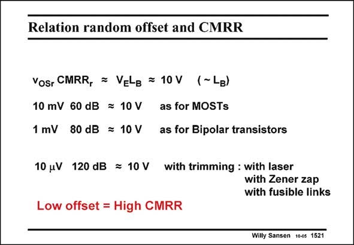

# SANSEN-1521 · Relation random offset and CMRR

章节：15 失调与共模抑制比：随机误差及系统误差  
PDF 页：423；书本页：431；幻灯片编号：1521  
状态：unreviewed



## 对应教材讲解

### PDF 423 · 书本 431

For an average value for V L of 10 V, it becomes E B clear that decreasing the offset or increasing the CMRR is the same design task. If an offset can be expected of about 10 mV, as for many MOST differential pairs and opamps, then a CMRR of approximately 60 dB can be expected. If, on the other hand, the offset is 10 times smaller, as for bipolar opamps, then the CMRR is 20 dB higher as well. If the offset is trimmed down to the mV level, then the CMRR increases accordingly. Note however, that a CMRR of 120 dB can only be reached provided the offset is trimmed down to 10 mV. This is not an easy task whatever technique is used.

## 公式／性能结论候选摘录

以下为规则截取的原文，尚未逐项判读。

- PDF 423: If the offset is trimmed down to the mV level, then the CMRR increases accordingly.

## 曲线结论候选摘录

以下为规则截取的原文，尚未逐项判读。

（未由规则找到；不代表原页没有此类内容。）

## 原文条件与近似候选摘录

以下为规则截取的原文，尚未逐项判读。

- PDF 423: If an offset can be expected of about 10 mV, as for many MOST differential pairs and opamps, then a CMRR of approximately 60 dB can be expected.
- PDF 423: Note however, that a CMRR of 120 dB can only be reached provided the offset is trimmed down to 10 mV.

## 幻灯片 OCR（未校正）

```text
Relation random offset and CMRR
Vosr CMRR, = VELg = 10V (~ LB)
10 mV 60 dB = 10 V as for MOSTs
1 mV 80 dB = 10 V as for Bipolar transistors
10 uV 120 dB = 10 V with trimming : with laser
with Zener zap
with fusible links
Low offset = High CMRR
Wily Sansen 100s 1521
```

数学上下标、分数及正负号以原图为准。电路图已保留；未核对的连接不输出成可仿真 netlist。
